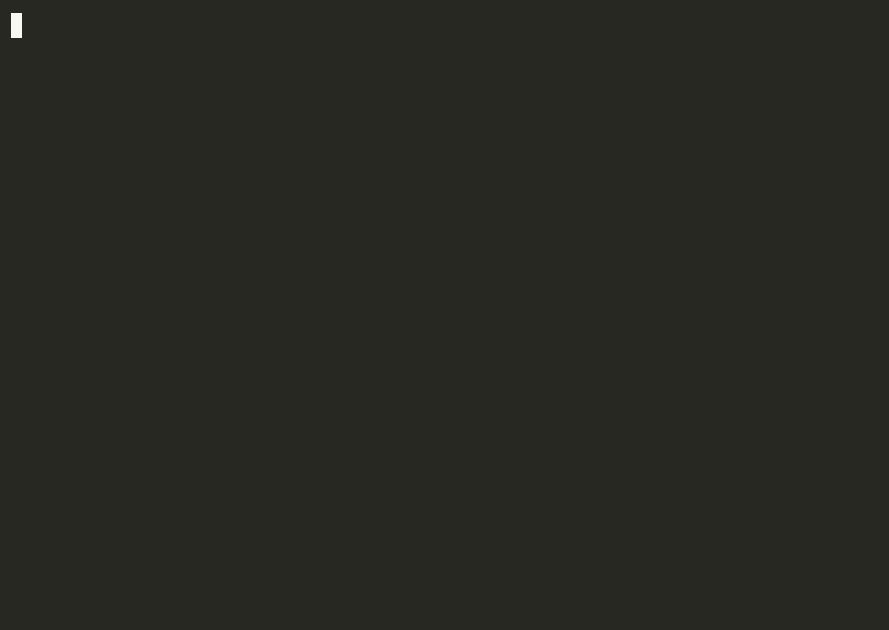

# claude-base

> **Make Claude Code follow a real engineering workflow** — Explore → Specify → Plan → TDD → Audit → Commit — with guardrails that test-first, audit to a quality score, and block secrets + destructive commands automatically.

Most Claude Code setups add more agents. claude-base adds **discipline and safety**: per-file rules, hooks, and an anti-drift CI gate. One install, auto-detects your stack — and it **learns from your mistakes across every project** so you stop repeating them.

**What it takes off your plate, every session:**
- **re-explaining your standards** — a human-gated lessons store carries them across *all* your projects, so a mistake fixed once doesn't come back;
- **the agent "passing" its own checks** with a hollow test, a stub, or a quietly-weakened linter — the anti-gaming layer blocks that;
- **finding it in review** — a hardcoded secret, a commit over failing tests, or a `--no-verify` bypass is stopped at the hook, before it lands.

[](https://github.com/christopherlouet/claude-base/actions/workflows/ci.yml)
[](https://github.com/christopherlouet/claude-base/actions/workflows/security.yml)
[](./tests)
[](https://github.com/christopherlouet/claude-base/releases/latest)
[](./LICENSE)



_A real `curl | bash` install + `claude-base init` scaffolding the foundation into a project — start to finish._

## Try it (30 seconds)

**Requires:** the [Claude Code CLI](https://code.claude.com/docs/en/overview) (the `claude` command), plus `git` and `jq` on your PATH (`claude-base init` reads JSON manifests with `jq`).

```bash
# 1. Install the foundation (clones to ~/.local/share/claude-base, symlinks to ~/.local/bin)
curl -fsSL https://raw.githubusercontent.com/christopherlouet/claude-base/main/install.sh | bash
claude-base version          # ✓ should print: claude-base v5.0.0

# 2. Install into a project (auto-detects the stack, picks the right preset)
claude-base init --preset nextjs ./my-app
# or just: claude-base init ./existing-project   (interactive, auto-detects)
# ✓ prints a summary of the .claude/ files written into the project

# 3. Open Claude Code in the project and run the canonical workflow
cd ./my-app && claude
> /work:work-flow-feature "add a /counter route with optimistic UI"
```

That last command chains the 6 phases automatically: Explore → Specify → Plan → TDD → Audit → Commit. Each phase has dedicated slash commands you can also drive manually.

## Is it for you?

| You are... | This helps... | Skip it if... |
|---|---|---|
| **Solo dev** shipping side-projects with Claude Code | preset gives you stack + workflow rigor in 30s ; no copy-pasting prompts between sessions | you barely use Claude Code yet — start with the [official docs](https://code.claude.com/docs/en/overview) first |
| **Team lead** wanting consistent Claude Code outputs across a codebase | enforces TDD + audit-loop gates in shared `.claude/` config, anti-drift counters CI-gated | your team has already built bespoke prompts you're happy with |
| **Educator / mentor** | the 6-phase workflow is named, teachable, and the audit-loop produces a quality score | you only need ad-hoc Claude Code use |
| **Returning user** who tried Claude Code, found it too freeform | the dispatcher CLI stays small and learnable, and the foundation is fully reversible (`claude-base uninstall`) | you prefer raw `.claude/` files without a foundation layer |

**You don't have to learn the <!-- count:commands -->106<!-- /count --> commands.** The core loop is six slash-commands — one per phase: `/work:work-explore`, `/work:work-specify`, `/work:work-plan`, `/dev:dev-tdd`, `/qa:qa-loop`, `/work:work-pr`. The rest are domain-specific (CI, a11y, payment, GDPR, etc.) and either auto-trigger via path rules or stay one slash away when relevant.

## How it compares

claude-base is the opinionated **discipline layer for Claude Code**.

**The workflow itself is now table-stakes** — a spec → plan → implement flow ships in most serious Claude Code setups. What's rarer is that claude-base doesn't *suggest* the discipline, it **enforces it and resists gaming**:

- **Anti-gaming layer** — its clearest differentiator: a [capability audit](docs/POSITIONING.md#capability-comparison) of similar projects found no other shipping it. You can't slip a hollow / `.only` test or a stub through, or weaken a linter config, to make a gate "pass" without doing the work.
- **Enforced by default, not opt-in** — a commit over failing tests, a hardcoded secret, or `git --no-verify` is *blocked* at the hook level, not just discouraged in a prompt.
- **Learns across all your projects** — a human-gated, sanitized **lessons referential**: after a hard-won fix or a correction, claude-base proposes a one-line lesson and, on your approval, stores it in your own `~/.claude/rules/lessons.md` — loaded into *every* project. Unlike auto-learners, *you* approve each lesson, and it's never committed to a repo. [How it works →](docs/recipes/personal-lessons-referential.md)
- **Curated vendor skills, kept fresh** — instead of guessing among 6,700+ community skills, you get a vetted shortlist of *which* ones to trust. A billing-safe engine re-checks them for rot/abandonment and surfaces new candidates — *observe-never-install*: nothing lands in your project without you.

A capability comparison against similar projects (with sources) is in [**docs/POSITIONING.md**](docs/POSITIONING.md#capability-comparison). It composes with the tools below rather than competing with them:

- **vs [Spec Kit](https://github.com/github/spec-kit)** (agent-agnostic SDD primitives) — spec-kit gives you `specify / plan / tasks / implement` across 30+ agents; claude-base adds what it doesn't: an Explore phase, *enforced* TDD, the audit-fix loop, path-specific rules, and hooks — Claude-Code-native. Use both: spec-kit for the primitives, claude-base for the discipline.
- **vs the [official marketplace](https://code.claude.com/docs/en/discover-plugins)** (vendor-published single-tool skills) — the marketplace ships deep per-tool coverage; claude-base is the workflow layer + a curated, billing-safe list of *which* vendor skills to trust. They pair: foundation for the rigor, vendor skills for the depth.

The complete net of ~25 enforced checkpoints a bare Claude project lacks — method, security, verification, anti-gaming, audit, integrity — is catalogued in [**docs/GUARDRAILS.md**](docs/GUARDRAILS.md).

Full positioning — comparison tables, the curation engine, and where it's heading — in [**docs/POSITIONING.md**](docs/POSITIONING.md).

> **A default install ships the core only.** The horizontal activity domains (`biz`, `legal`, `growth`) and the stack/thematic domains (`nextjs`, `flutter`, `iac`, `observability`, …) are **opt-in modules** (`claude-base add <module>`) — run `claude-base modules` to list all 15. A fresh project gets the smaller core slice. See [`specs/horizontal-pure-modules/`](specs/horizontal-pure-modules/).

## What you get on disk

After `claude-base init`, your project gains:

```
your-project/
├── CLAUDE.md              # Project instructions auto-loaded by Claude Code
├── .claude/
│   ├── settings.json      # Hooks, permissions, plugin enablement
│   ├── commands/          # Slash commands grouped by domain (work, dev, qa, ops, ...)
│   ├── agents/            # Sub-agents with isolated context
│   ├── skills/            # Auto-triggered on keywords
│   ├── rules/             # Path-specific rules (TDD, security, a11y, performance)
│   ├── presets/           # Stack-specific bundle manifests
│   └── output-styles/     # Output rendering styles
└── .github/               # (optional) CI workflows + pre-commit hooks
```

Everything is plain markdown + JSON. No daemon, no telemetry, no network access at runtime. Reversible via `claude-base uninstall`.

## What's included

| Component | Count | What it is |
|---|---|---|
| Slash commands | <!-- count:commands -->106<!-- /count --> across 9 domains (work, dev, qa, ops, doc, biz, growth, data, legal) | Manually triggered (`/work:work-plan`) |
| Sub-agents | <!-- count:agents -->45<!-- /count --> | Autonomous, isolated-context workers spawned by commands |
| Skills | <!-- count:skills -->53<!-- /count --> | Auto-triggered on keywords in your prompts |
| Path-specific rules | <!-- count:rules -->32<!-- /count --> | Auto-activated based on the file being edited (TS strict, OWASP, WCAG, YAGNI/minimal-code, ...) |
| Presets | <!-- count:presets -->11<!-- /count --> | Stack-specific bundles ; tier breakdown in [Going deeper](#going-deeper) |

**Learns across projects.** A personal, human-gated **lessons referential**: after a hard-won fix or a correction, claude-base proposes a generalized, sanitized one-line lesson and — on your confirmation — stores it in your own `~/.claude/rules/lessons.md`, which Claude Code loads into **every** project. A mistake made once stops recurring everywhere; run `/lessons --bootstrap` to seed it from what you already learned. The lessons stay yours — never committed to any repo. [How it works →](docs/recipes/personal-lessons-referential.md)

Full catalogue: [Docusaurus reference](https://christopherlouet.github.io/claude-base/docs/reference) — or browse `.claude/` directly after install.

## The 6-phase workflow in action

After install, you `cd ./my-app && claude` and the foundation drives the workflow (the GIF at the top of this page is the real install, recorded in an isolated Docker container — reproducible, scaffolding under [`website/demo/`](./website/demo/)):

```
> /work:work-flow-feature "add a /counter route with optimistic UI"

[work-explore]  Scans app/, hooks/, lib/ → detects the project shape
[work-specify]  Drafts user stories + acceptance criteria
[work-plan]     Lists the files to touch + identifies risks
[dev-tdd]       RED → GREEN → REFACTOR cycle, tests before code
[qa-loop]       Audit + auto-fix until target score (default ≥ 90)
[work-pr]       Branch, commit, push, open the PR
```

One command chains the 6 phases. Each phase is also runnable on its own (`/work:work-explore`, `/dev:dev-tdd`, etc.) if you prefer manual control.

## Installation

### Option 1: One-liner (recommended)

```bash
curl -fsSL https://raw.githubusercontent.com/christopherlouet/claude-base/main/install.sh | bash
```

This clones the foundation to `~/.local/share/claude-base` and symlinks the
dispatcher into `~/.local/bin/claude-base`. The installer never runs as root,
never modifies your shell rc files, and needs only `git` to run (the next step, `claude-base init`, additionally needs `jq` — see [Requirements](#try-it-30-seconds)). After install:

```bash
claude-base init --preset fastapi ./my-api      # Python backend
claude-base init --preset nextjs   ./my-web-app # Next.js fullstack
claude-base init --simple          ./my-project # Foundation only, no preset
claude-base preset list                          # Discover available presets
claude-base help                                 # All commands
```

To update the foundation later:

```bash
curl -fsSL https://raw.githubusercontent.com/christopherlouet/claude-base/main/install.sh | bash -s -- --update
```

#### Pinning to a release (reproducible installs)

The one-liner above tracks the moving `main` tip. To install a specific, tested
release instead, pass `--ref <tag>` — still a single line:

```bash
curl -fsSL https://raw.githubusercontent.com/christopherlouet/claude-base/main/install.sh | bash -s -- --ref v5.0.0
```

A pinned install **stays pinned** across `--update` (it never silently jumps to
`main`). To move it to another release, pass `--ref <newtag>`; to return to the
latest `main`, pass `--ref main`.

#### Verify before executing (supply-chain conscious)

Piping any script straight into your shell runs it unverified — our own
[`security.md`](.claude/rules/security.md) rule says to *download → verify →
execute*, and a hook in this repo blocks `curl … | sh` in agent sessions. Each
tagged release publishes a `SHA256SUMS` asset, so you can honor that on install:

```bash
TAG=v5.0.0
curl -fsSL "https://raw.githubusercontent.com/christopherlouet/claude-base/$TAG/install.sh" -o install.sh
curl -fsSL "https://github.com/christopherlouet/claude-base/releases/download/$TAG/SHA256SUMS" -o SHA256SUMS
sha256sum --check --ignore-missing SHA256SUMS   # must print: install.sh: OK
bash install.sh --ref "$TAG"
```

Fetch `install.sh` from the **same tag** as the checksum (`/$TAG/`, not `/main/`)
— the published `SHA256SUMS` covers the tagged script, not the moving tip.

If `~/.local/bin` is not on your `PATH`, add it (most modern distros already do):

```bash
export PATH="$HOME/.local/bin:$PATH"  # add to ~/.bashrc or ~/.zshrc
```

### Option 2: Manual git clone

```bash
git clone https://github.com/christopherlouet/claude-base.git
cd claude-base

# Install in an existing project (in-repo dispatcher — no PATH install yet)
./bin/claude-base init --simple /path/to/your/project

# Full install with CI/CD, hooks, Docker
./bin/claude-base init --all /path/to/your/project
```

### Option 3: Manual copy (minimal)

```bash
# Copy the Claude configuration directly
cp -r claude-base/.claude your-project/
cp claude-base/CLAUDE.md your-project/

# Optional
cp claude-base/.mcp.json your-project/
cp claude-base/.github your-project/ -r
```

### Keeping Claude Code itself up to date

The commands above install and update **claude-base** — they do not touch the underlying Claude Code CLI. If you installed Claude Code through Homebrew or WinGet, you can opt into background upgrades by exporting `CLAUDE_CODE_PACKAGE_MANAGER_AUTO_UPDATE=1` in your shell. This has no effect on the curl one-liner install of claude-base, and no effect if you installed Claude Code through any other channel. Available in Claude Code 2.1.129+.

## Repository layout

After `curl | bash` install, the foundation lives at `~/.local/share/claude-base/`. The repo's top-level layout:

| Path | Role |
|---|---|
| `bin/claude-base` | CLI dispatcher (`init` / `update` / `validate` / `doctor` / `lessons` / `add` / `remove` / `modules` / `preset` / `uninstall` / `version` / `help`) |
| `install.sh` | One-liner installer — clones to `~/.local/share/claude-base/`, symlinks the dispatcher to `~/.local/bin/` |
| `.claude/` | Foundation kit — `skills/`, `agents/`, `commands/`, `rules/`, `presets/`, `output-styles/`, `templates/`, `settings.json` |
| `scripts/` | Implementation scripts behind the CLI + maintenance tools (`audit-base.sh`, `audit-docs.sh`, `doctor.sh`, `diff.sh`, ...) + hook scripts |
| `templates/` | Stack-specific `CLAUDE.*.md` templates + advisory docs (`FAQ.md`, `PERFORMANCE-GUIDE.md`, `TROUBLESHOOTING.md`) |
| `docs/` | Human-maintained documentation — `QUICKSTART.md`, `CHEATSHEET.md`, `ARCHITECTURE.md`, `WORKFLOWS.md`, `STACK-RECIPES.md`, `CUSTOMIZATION.md`, `recipes/`, `reference/`, `guides/` |
| `website/` | [Docusaurus site](https://christopherlouet.github.io/claude-base/) — `docs/` is auto-mirrored here by `npm --prefix website run generate` |
| `specs/` | Feature specs consumed by the workflow agents (`/work:work-specify`, `/work:work-plan`) |
| `tests/` | <!-- count:tests -->1445<!-- /count --> bats tests across <!-- count:testFiles -->63<!-- /count --> files |
| `.github/workflows/` | CI : `ci.yml`, `security.yml`, `docs.yml`, `pr-check.yml`, `release.yml`, `dependabot-auto-merge.yml` |
| `AGENTS.md`, `CHANGELOG.md`, `VERSION`, `LICENSE`, `SECURITY.md`, `CONTRIBUTING.md`, `CODE_OF_CONDUCT.md`, `counts.json` | Project metadata |

For the full file-by-file reference, see the [Docusaurus reference docs](https://christopherlouet.github.io/claude-base/docs/reference).

## Available Commands (<!-- count:commands -->106<!-- /count -->)

Commands are grouped into 9 domains:

| Domain | Count | Examples |
|---------|------:|----------|
| `work-` | <!-- count:byDomain.work -->15<!-- /count --> | `/work:work-explore`, `/work:work-plan`, `/work:work-commit`, `/work:work-pr`, `/work:work-flow-feature` |
| `dev-` | <!-- count:byDomain.dev -->16<!-- /count --> | `/dev:dev-tdd`, `/dev:dev-debug`, `/dev:dev-api`, `/dev:dev-flutter`, `/dev:dev-prisma` |
| `qa-` | <!-- count:byDomain.qa -->13<!-- /count --> | `/qa:qa-loop`, `/qa:qa-security`, `/qa:qa-perf`, `/qa:wcag-audit`, `/qa:qa-e2e` |
| `ops-` | <!-- count:byDomain.ops -->28<!-- /count --> | `/ops:ops-deploy`, `/ops:ops-docker`, `/ops:ops-monitoring`, `/ops:ops-k8s`, `/ops:ops-rollback` |
| `doc-` | <!-- count:byDomain.doc -->5<!-- /count --> | `/doc:doc-onboard`, `/doc:doc-explain`, `/doc:doc-changelog`, `/doc:doc-generate` |
| `biz-` | <!-- count:byDomain.biz -->9<!-- /count --> | `/biz:biz-model`, `/biz:biz-mvp`, `/biz:biz-pricing`, `/biz:biz-personas` |
| `growth-` | <!-- count:byDomain.growth -->9<!-- /count --> | `/growth:growth-landing`, `/growth:growth-seo`, `/growth:growth-cro`, `/growth:growth-analytics` |
| `data-` | <!-- count:byDomain.data -->2<!-- /count --> | `/data:data-pipeline`, `/data:data-modeling` |
| `legal-` | <!-- count:byDomain.legal -->5<!-- /count --> | `/legal:legal-rgpd`, `/legal:legal-terms-of-service`, `/legal:legal-privacy-policy` |

→ **Full list**: [docs/CHEATSHEET.md](docs/CHEATSHEET.md) or the [Docusaurus catalog](https://christopherlouet.github.io/claude-base/docs/commands).

→ **By stack**: [docs/STACK-RECIPES.md](docs/STACK-RECIPES.md) lists the relevant commands for each stack (Web, Mobile, API, Auth, etc.).

## Recommended Workflow

The fastest way in is the built-in orchestrator — or run the six phases yourself:

```
/assistant              # guided: explains the workflow and suggests the next command
/assistant-auto "..."   # automatic: routes your request to the right workflow
```

### Practical example (one phase at a time)

```bash
# 1. Explore the existing system
/work:work-explore the authentication system

# 2. Specify the feature (User Stories + acceptance criteria)
/work:work-specify add OAuth2 Google sign-in

# 3. Plan the implementation
/work:work-plan OAuth2 Google

# 4. Implement in TDD (tests BEFORE the code)
/dev:dev-tdd OAuth2 authentication flow

# 5. Audit + fix loop (score 90 required)
/qa:qa-loop "score 90"

# 6. Open the PR
/work:work-pr OAuth2 Google authentication
```

The shape is identical for any stack — swap the arguments (e.g. `/dev:dev-tdd UserProfileScreen with BLoC + widget tests` for a Flutter screen). The single `/work:work-flow-feature "..."` command chains all six phases for you.

## Available Templates

| Template | Language / Framework |
|----------|---------------------|
| `CLAUDE.react.md` | React |
| `CLAUDE.nextjs.md` | Next.js (App Router) |
| `CLAUDE.vue.md` | Vue.js 3 |
| `CLAUDE.node-api.md` | Node.js API |
| `CLAUDE.python.md` | Python |
| `CLAUDE.go.md` | Go |
| `CLAUDE.rust.md` | Rust |
| `CLAUDE.java.md` | Java / Spring Boot |
| `CLAUDE.fullstack.md` | Fullstack monorepo |
| `CLAUDE.flutter.md` | Flutter / Dart (Mobile) |
| `CLAUDE.neovim.md` | Neovim / Lua config |

```bash
# Recommended: scaffold via the dispatcher (works post-install, any cwd)
claude-base init --type react ./my-app

# Or copy the template manually (from a foundation clone)
cp templates/CLAUDE.react.md CLAUDE.md
```

The dispatcher path additionally wires hooks, settings, and preset-specific filtering ; the raw `cp` only installs the project-instructions file.

## Utility CLI (`claude-base`)

After `curl | bash` install, the unified dispatcher is on your PATH. Use it as the canonical entry point:

```bash
# Create a new project (interactive)
claude-base init

# Install in an existing project
claude-base init --simple /path/to/project

# Update commands
claude-base update /path/to/project

# Validate the configuration
claude-base validate /path/to/project
claude-base validate --json /path/to/project   # for CI/CD

# Diagnose a project (config, deps, and downstream security drift)
claude-base doctor /path/to/project

# Add / remove / list the opt-in domain modules
claude-base modules
claude-base add nextjs /path/to/project

# Personal cross-project lessons (seed, prune the store)
claude-base lessons bootstrap-scan
/lessons --bootstrap    # the guided flow, from inside Claude Code

# Uninstall
claude-base uninstall /path/to/project
```

Maintenance tools without a dispatcher alias (still callable directly from a foundation clone):

```bash
# Diff against the foundation
./scripts/diff.sh /path/to/project

# IDE integration (VSCode, IntelliJ, Vim/Neovim)
./scripts/ide.sh setup vscode
```

## IDE Integration

```bash
./scripts/ide.sh setup <vscode|idea|vim|all>   # configure
./scripts/ide.sh check  <vscode|idea|vim>      # verify
./scripts/ide.sh remove <vscode|idea|vim>      # uninstall
```

Sets up Settings/Tasks/Extensions/Snippets (VSCode/Cursor), Run Configurations/Code Style/Templates (IntelliJ), or Abbreviations/Mappings/Autocmds (Vim/Neovim). Run `./scripts/ide.sh --help` for the full surface.

## CI/CD Included

### GitHub Actions

- **ci.yml**: Tests (bats + node), shellcheck, lint, build
- **security.yml**: Gitleaks + shellcheck-security workflow
- **pr-check.yml**: PR format / size / labels validation (uses `amannn/action-semantic-pull-request`)
- **docs.yml**: Builds and deploys the Docusaurus site to GitHub Pages
- **release.yml**: Automated releases with changelog
- **dependabot-auto-merge.yml**: Auto-merges dependabot PRs that pass CI

Full file-by-file at `.github/workflows/`.

### Pre-commit Hooks

The foundation ships `.husky/` with auto-lint, Conventional Commits validation, and secret detection (gitleaks). Enabled automatically when `claude-base init` runs with `--hooks` or `--all`. To re-enable manually in an existing install : `npx husky install` (assumes husky + lint-staged + commitlint are already in your project's devDependencies).

## Documentation

### Online documentation

The full documentation site lives at **[https://christopherlouet.github.io/claude-base/](https://christopherlouet.github.io/claude-base/)**.

It covers:
- Quick start guide
- Catalog of <!-- count:commands -->106<!-- /count --> commands, <!-- count:agents -->45<!-- /count --> agents, <!-- count:skills -->53<!-- /count --> skills, <!-- count:rules -->32<!-- /count --> rules
- Recommended workflows (Explore → Specify → Plan → TDD → Audit → Commit)
- Stack Recipes: relevant commands per stack (Web, Mobile, API, Auth, Database, Infra, Observability, Testing, Data, AI/LLM, Business, Growth)
- Specific guides: Learning path, Extending, Team, Prompting, Troubleshooting

### Local documentation

- **[QUICKSTART.md](docs/QUICKSTART.md)**: 5-minute getting started
- **[CHEATSHEET.md](docs/CHEATSHEET.md)**: Command quick reference
- **[ARCHITECTURE.md](docs/ARCHITECTURE.md)**: Commands vs Agents vs Skills vs Rules
- **[GUARDRAILS.md](docs/GUARDRAILS.md)**: The ~25 enforced checkpoints (method, security, verification, anti-gaming, audit, integrity) a bare Claude project lacks
- **[WORKFLOWS.md](docs/WORKFLOWS.md)**: Workflow diagrams
- **[STACK-RECIPES.md](docs/STACK-RECIPES.md)**: Commands/agents/skills per stack (Web, Mobile, API…)
- **[CUSTOMIZATION.md](docs/CUSTOMIZATION.md)**: Customization guide
- **[recipes/](docs/recipes/)**: Targeted recipes — recommended vendor skills, Python toolchain options, SaaS monetization, nightly curation-bot deploy, etc.
- **[guides/EXTENDING-GUIDE.md](docs/guides/EXTENDING-GUIDE.md)**: Extend the foundation (custom commands/skills/rules)
- **[guides/TEAM-GUIDE.md](docs/guides/TEAM-GUIDE.md)**: Team adoption — including [`When .claude/ is gitignored`](docs/guides/TEAM-GUIDE.md#when-claude-is-gitignored--scope-choices-for-plugins--skills) (scope choices for plugins & skills)
- **[guides/PROMPTING-GUIDE.md](docs/guides/PROMPTING-GUIDE.md)**: Prompting techniques
- **[guides/TROUBLESHOOTING-GUIDE.md](docs/guides/TROUBLESHOOTING-GUIDE.md)**: Common issues and fixes
- **Learning path** (Docusaurus only): [9h30, 5 levels novice → pro](https://christopherlouet.github.io/claude-base/docs/guides/learning-path)

## Resources

- [Claude Code Best Practices](https://www.anthropic.com/engineering/claude-code-best-practices)
- [Claude Code Documentation](https://code.claude.com/docs/en/overview)
- [How Anthropic Teams Use Claude Code](https://www.anthropic.com/news/how-anthropic-teams-use-claude-code)

## Secret Detection (gitleaks)

The foundation ships a pre-configured [gitleaks](https://github.com/gitleaks/gitleaks) ruleset at `.gitleaks.toml`. It runs automatically via pre-commit hooks (when enabled) and on every PR through `security.yml`. Detected categories include AWS/GitHub/GitLab/Stripe/Slack tokens, JWTs, private keys, and database URLs — see `.gitleaks.toml` for the exact rules.

Install gitleaks itself per the [upstream instructions](https://github.com/gitleaks/gitleaks#installing). Local scan :

```bash
gitleaks detect --source . --config .gitleaks.toml          # full scan
gitleaks detect --staged --config .gitleaks.toml            # staged-only (pre-commit)
```

## Automated Tests

The foundation ships with [bats-core](https://github.com/bats-core/bats-core) tests that validate every script. Install bats via the [upstream instructions](https://github.com/bats-core/bats-core#installation) (or `./scripts/test.sh --install-bats` to use the foundation's bundled helper).

```bash
./scripts/test.sh                # parallel run, all tests
./scripts/test.sh validate       # filter to one suite (e.g. validate.bats)
./scripts/test.sh -v             # verbose
```

### Test layout

<!-- count:tests -->1445<!-- /count --> bats tests across <!-- count:testFiles -->63<!-- /count --> files. A few anchors :

| Area | File | Tests |
|---|---|---|
| Smoke + utility | `smoke.bats`, `common.bats` | Fast integrity check + lib unit tests |
| Installer + dispatcher | `install.bats`, `new-project.bats`, `dispatcher.bats` | One-liner installer, `claude-base init` flow, CLI dispatcher |
| Update flow | `update.bats`, `update-presets.bats` | Refresh logic, preset-aware filters |
| Preset system | `presets.bats`, `preset-detect.bats`, `preset-e2e.bats` | Manifest schema, data-driven detection, per-preset E2E |
| Quality gates | `validate.bats`, `qa-loop.bats`, `audit-docs.bats` | Validation, audit-fix loop, doc-drift firewall |
| End-to-end | `e2e.bats` | Full bootstrap → validate → uninstall cycle |
| Drift guards | `manifest-hooks-coverage.bats`, `docs-under-claude.bats` | Hooks coverage, structural layout |

Full file-by-file inventory at `tests/`. Run via `./scripts/test.sh` (parallel) or `bats tests/*.bats` (sequential).

## Upgrades & Changelog

For per-release details (Added / Changed / Fixed / Security / Removed), see [CHANGELOG.md](CHANGELOG.md) — kept in [Keep a Changelog](https://keepachangelog.com/en/1.1.0/) format.

### Upgrading an installed project

```bash
# Upgrade the foundation itself (refreshes ~/.local/share/claude-base)
curl -fsSL https://raw.githubusercontent.com/christopherlouet/claude-base/main/install.sh | bash -s -- --update

# Refresh an installed project to the current foundation
claude-base update /path/to/your/project

# Or refresh with a specific preset filter applied
claude-base update --preset nextjs /path/to/your/project

# Read-only: check whether your project still matches its recorded preset
claude-base update --detect-only /path/to/your/project
```

`claude-base update` is COPY-only by default — existing files in your project's `.claude/` are not deleted. Pass `--clean` to wipe-and-replace (a backup is created first). `update` also **flags a stack pivot**: if your project has outgrown its recorded preset (e.g. a Vite SPA that grew into Next.js), it prints a non-blocking notice pointing at `claude-base update --preset <name>`; `--detect-only` reports that check (`Diverges: yes/no`) without updating anything.

### Versioning policy

The foundation follows [Semantic Versioning](https://semver.org/). Each release is tagged `vX.Y.Z` and shipped with a GitHub Release containing the relevant CHANGELOG excerpt. Pin via `git checkout vX.Y.Z` in `~/.local/share/claude-base` if you need reproducible installs. Behaviour-breaking changes between minor versions are explicitly called out in the CHANGELOG under `### Breaking`.

## Production Readiness

Concrete signals rather than a self-assessment score :

- <!-- count:tests -->1445<!-- /count --> bats tests run on every PR (Linux + macOS), parallelised via `./scripts/test.sh`
- Six GitHub Actions workflows (CI, security, docs, PR check, release, dependabot auto-merge) gating merges
- Doc drift firewall (`scripts/audit-docs.sh`) catches syntactic doc drift before merge — see [PR #201](https://github.com/christopherlouet/claude-base/pull/201)
- Counter anti-drift gate (`scripts/validate-counts.sh`) regenerated from `counts.json`
- Pinned versions via git tags (current : v<!-- version -->5.0.0<!-- /version -->) with full `CHANGELOG.md` in Keep-a-Changelog format

### Security measures

- **Gitleaks**: secret detection ruleset (CI workflow + local scan) — see `.gitleaks.toml`
- **ShellCheck**: bash linting on all `scripts/` (CI workflow `security.yml`, severity warning)
- **Deny list**: dangerous commands blocked (`rm -rf /`, `sudo`, `git push --force`)
- **Protection hooks**: blocks edits on main/master
- **GitHub Secret Scanning**: enabled on the public repo
- **GitHub Code Scanning** (CodeQL): JavaScript/TypeScript security analysis (Default Setup — repo-wide)
- **Downstream drift detection**: `claude-base doctor` (and an advisory after `claude-base update`) flags an installed project whose `settings.json` / hook scripts have fallen behind the foundation — e.g. security hooks on a stale input contract that would silently no-op — and points you at the resync command
- **Verified install**: `install.sh --ref <tag>` pins to a released tag and each release publishes `SHA256SUMS`, so the installer can be verified before execution (see [Installation](#installation))

See [SECURITY.md](SECURITY.md) for the full security policy.

## Going deeper

Detail-level docs and editorial pieces that didn't make the front-door:

- **Three preset tiers** — `maintainer-vouched` (production use ≥3 months) / `vendor-pointer` (vendor-authored, validated via marketplace audit) / `community-curated` (signed maintenance commitment). See [`.claude/presets/README.md`](./.claude/presets/README.md) and [`specs/presets-vendor-pointer-tier/spec.md`](./specs/presets-vendor-pointer-tier/spec.md).
- **Pre-detection category prompt** — when `claude-base init` runs on an empty directory with no preset/type and no auto-detect match, an interactive 8-entry intent prompt narrows the menu. Spec: [`specs/preset-category-prompt/spec.md`](./specs/preset-category-prompt/spec.md).
- **Cross-tool compatibility** — `AGENTS.md` at repo root signals SKILL.md open-standard compliance to Codex, Cursor, Copilot, Gemini CLI. Skills under `.claude/skills/` use the standard frontmatter ; Claude-specific extensions are silently ignored by other tools. See [`AGENTS.md`](./AGENTS.md).
- **Doc drift firewall** — `scripts/audit-docs.sh` catches 5 categories of syntactic drift (paths, claude-base verbs, init/update flags, local scripts, npm scripts) before merge. CI-gated.

### Long-term direction

The foundation lives **alongside** the marketplace, not against it: its irreducible value is the workflow rigor + path rules, while tool-specific depth increasingly ships as vendor skills. Four mechanisms keep it aligned with that trajectory (a billing-safe curation engine, advice-neutrality over publisher-veto, per-preset recommendations with drift tracking, and trajectory-driven automation) — detailed in [**docs/POSITIONING.md**](docs/POSITIONING.md#long-term-direction).
