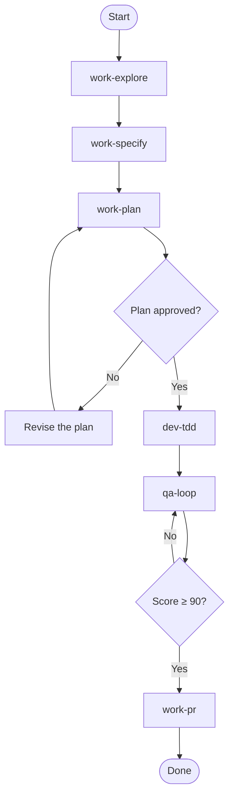
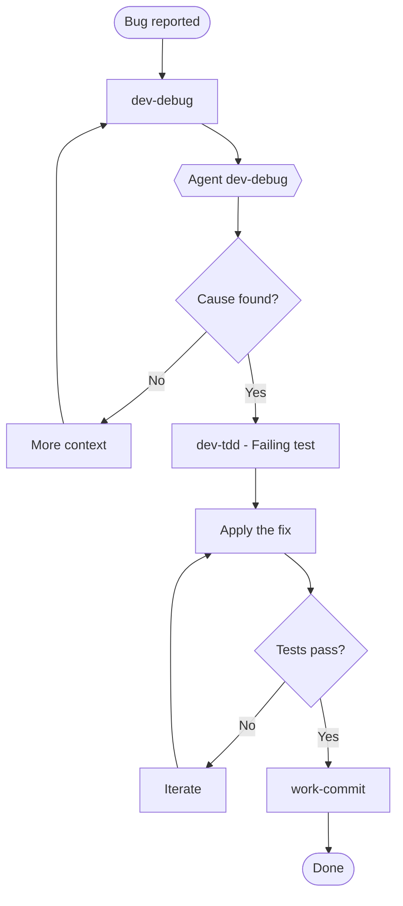
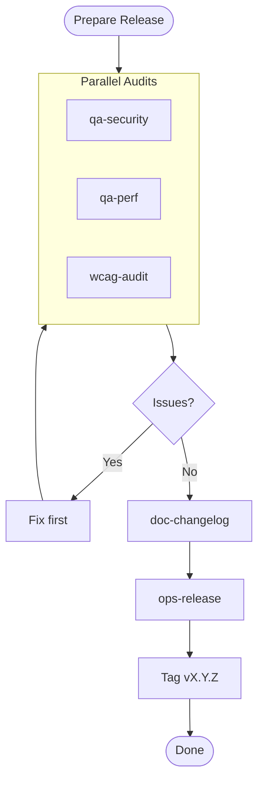
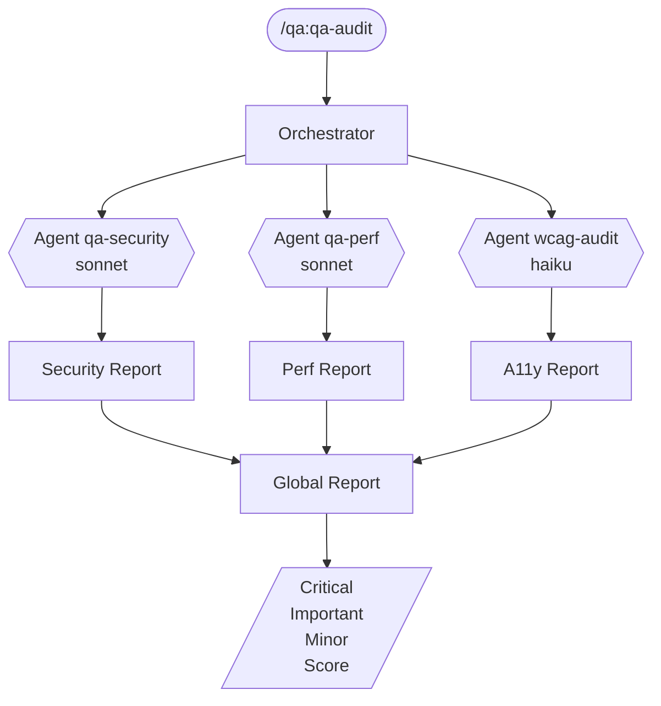
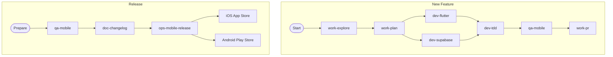
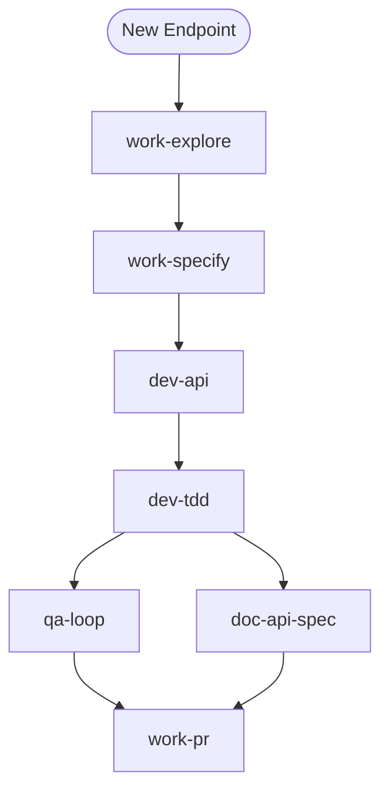
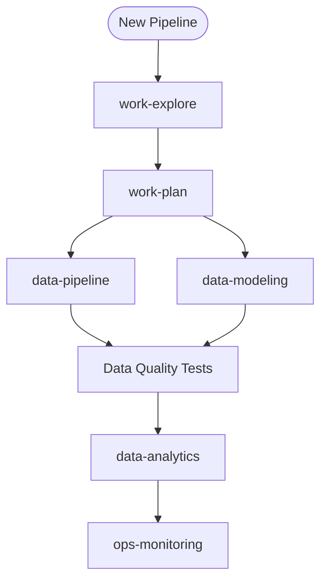

<!-- Auto-generated from docs/ - DO NOT EDIT -->

# Visual Workflows

> Diagrams of the recommended workflows

## Main Workflow: Explore → Specify → Plan → TDD → Audit → Commit

```
┌─────────────────────────────────────────────────────────────────────────────────────┐
│                                                                                     │
│   ┌─────────┐   ┌─────────┐   ┌───────┐   ┌───────┐   ┌───────┐   ┌─────────┐      │
│   │ EXPLORE │──▶│ SPECIFY │──▶│ PLAN  │──▶│  TDD  │──▶│ AUDIT │──▶│ COMMIT  │      │
│   └─────────┘   └─────────┘   └───────┘   └───────┘   └───────┘   └─────────┘      │
│        │             │             │           │           │           │            │
│        ▼             ▼             ▼           ▼           ▼           ▼            │
│   /work:work-explore  /work:work-specify  /work:work-plan  /dev:dev-tdd  /qa:qa-loop  /work:work-commit │
│                                                                                     │
└─────────────────────────────────────────────────────────────────────────────────────┘
```

### Mermaid
```mermaid
flowchart LR
    A[EXPLORE] --> B[SPECIFY]
    B --> C[PLAN]
    C --> D[TDD]
    D --> E[AUDIT]
    E --> F[COMMIT]

    A --> A1[/work:work-explore]
    B --> B1[/work:work-specify]
    C --> C1[/work:work-plan]
    D --> D1[/dev:dev-tdd]
    E --> E1[/qa:qa-loop]
    F --> F1[/work:work-commit]
```

## Full Feature Workflow

```
┌─────────────────────────────────────────────────────────────────────────────┐
│                           /work:work-flow-feature                                 │
│                                                                             │
│  ┌───────────────────────────────────────────────────────────────────────┐  │
│  │                                                                       │  │
│  │   START                                                               │  │
│  │     │                                                                 │  │
│  │     ▼                                                                 │  │
│  │   ┌─────────────┐                                                     │  │
│  │   │ work-explore│ ─────────────────────────────────┐                  │  │
│  │   └──────┬──────┘                                  │                  │  │
│  │          │                                         │                  │  │
│  │          ▼                                         ▼                  │  │
│  │   ┌─────────────┐                          ┌─────────────┐            │  │
│  │   │work-specify │                          │   RULES     │            │  │
│  │   │ User Stories│                          │ (typescript,│            │  │
│  │   │ + criteria  │                          │  react,     │            │  │
│  │   └──────┬──────┘                          │  security)  │            │  │
│  │          │                                 └─────────────┘            │  │
│  │          ▼                                                            │  │
│  │   ┌─────────────┐                                                     │  │
│  │   │  work-plan  │ Plan approved?                                      │  │
│  │   └──────┬──────┘                                                     │  │
│  │     ┌────┴────┐                                                       │  │
│  │     No       Yes                                                      │  │
│  │     │         │                                                       │  │
│  │     ▼         ▼                                                       │  │
│  │   Revise   ┌──────────────┐                                           │  │
│  │   the plan │   dev-tdd    │ Tests BEFORE the code (Red-Green-Refactor)│  │
│  │            └──────┬───────┘                                           │  │
│  │                   │                                                   │  │
│  │                   ▼                                                   │  │
│  │            ┌──────────────┐                                           │  │
│  │            │   qa-loop    │ Audit + fix loop (score ≥ 90)             │  │
│  │            └──────┬───────┘                                           │  │
│  │                   │                                                   │  │
│  │                   │ Score reached?                                    │  │
│  │              ┌────┴────┐                                              │  │
│  │             No        Yes                                             │  │
│  │              │         │                                              │  │
│  │              ▼         ▼                                              │  │
│  │           Iterate   ┌──────────────┐                                  │  │
│  │           qa-loop   │   work-pr    │                                  │  │
│  │                     └──────┬───────┘                                  │  │
│  │                            │                                          │  │
│  │                            ▼                                          │  │
│  │                          DONE                                         │  │
│  │                                                                       │  │
│  └───────────────────────────────────────────────────────────────────────┘  │
│                                                                             │
└─────────────────────────────────────────────────────────────────────────────┘
```

### Mermaid


## Bugfix Workflow

```
┌─────────────────────────────────────────────────────────────────────────────┐
│                           /work:work-flow-bugfix                                  │
│                                                                             │
│  ┌───────────────────────────────────────────────────────────────────────┐  │
│  │                                                                       │  │
│  │   BUG REPORTED                                                        │  │
│  │        │                                                              │  │
│  │        ▼                                                              │  │
│  │   ┌─────────────┐                                                     │  │
│  │   │  dev-debug  │────────┐                                            │  │
│  │   └──────┬──────┘        │                                            │  │
│  │          │               ▼                                            │  │
│  │          │        ┌─────────────┐                                     │  │
│  │          │        │   AGENT     │                                     │  │
│  │          │        │  dev-debug  │                                     │  │
│  │          │        │  (isolated) │                                     │  │
│  │          │        └──────┬──────┘                                     │  │
│  │          │               │                                            │  │
│  │          │◀──────────────┘                                            │  │
│  │          │                                                            │  │
│  │          │ Cause identified?                                          │  │
│  │     ┌────┴────┐                                                       │  │
│  │     │         │                                                       │  │
│  │    No        Yes                                                      │  │
│  │     │         │                                                       │  │
│  │     ▼         ▼                                                       │  │
│  │   More     ┌──────────────┐                                           │  │
│  │   context  │ dev-tdd      │ (failing test)                            │  │
│  │            └──────┬───────┘                                           │  │
│  │                   │                                                   │  │
│  │                   ▼                                                   │  │
│  │            ┌──────────────┐                                           │  │
│  │            │    FIX       │                                           │  │
│  │            └──────┬───────┘                                           │  │
│  │                   │                                                   │  │
│  │                   ▼                                                   │  │
│  │            ┌──────────────┐                                           │  │
│  │            │  Tests pass? │                                           │  │
│  │            └──────┬───────┘                                           │  │
│  │              ┌────┴────┐                                              │  │
│  │             No        Yes                                             │  │
│  │              │         │                                              │  │
│  │              ▼         ▼                                              │  │
│  │           Iterate  ┌──────────────┐                                   │  │
│  │                    │ work-commit  │                                   │  │
│  │                    └──────────────┘                                   │  │
│  │                                                                       │  │
│  └───────────────────────────────────────────────────────────────────────┘  │
│                                                                             │
└─────────────────────────────────────────────────────────────────────────────┘
```

### Mermaid


## Release Workflow

```
┌─────────────────────────────────────────────────────────────────────────────┐
│                           /work:work-flow-release                                 │
│                                                                             │
│  ┌───────────────────────────────────────────────────────────────────────┐  │
│  │                                                                       │  │
│  │   PREPARE RELEASE                                                     │  │
│  │        │                                                              │  │
│  │        ▼                                                              │  │
│  │   ┌──────────────────────────────────────────────┐                    │  │
│  │   │              PARALLEL AUDITS                  │                   │  │
│  │   │                                               │                   │  │
│  │   │  ┌─────────┐  ┌─────────┐  ┌─────────┐       │                   │  │
│  │   │  │qa-security│  qa-perf │  wcag-audit │        │                   │  │
│  │   │  │  AGENT  │  │ AGENT   │  │ AGENT  │        │                   │  │
│  │   │  └────┬────┘  └────┬────┘  └───┬────┘        │                   │  │
│  │   │       │            │           │              │                   │  │
│  │   │       └────────────┼───────────┘              │                   │  │
│  │   │                    │                          │                   │  │
│  │   └────────────────────┼──────────────────────────┘                   │  │
│  │                        │                                              │  │
│  │                        ▼                                              │  │
│  │                 ┌─────────────┐                                       │  │
│  │                 │   Issues?   │                                       │  │
│  │                 └──────┬──────┘                                       │  │
│  │                   ┌────┴────┐                                         │  │
│  │                  Yes       No                                         │  │
│  │                   │         │                                         │  │
│  │                   ▼         ▼                                         │  │
│  │                Fix      ┌─────────────┐                               │  │
│  │                first    │doc-changelog│                               │  │
│  │                         └──────┬──────┘                               │  │
│  │                                │                                      │  │
│  │                                ▼                                      │  │
│  │                         ┌─────────────┐                               │  │
│  │                         │ ops-release │                               │  │
│  │                         └──────┬──────┘                               │  │
│  │                                │                                      │  │
│  │                                ▼                                      │  │
│  │                         ┌─────────────┐                               │  │
│  │                         │    TAG      │                               │  │
│  │                         │  vX.Y.Z     │                               │  │
│  │                         └─────────────┘                               │  │
│  │                                                                       │  │
│  └───────────────────────────────────────────────────────────────────────┘  │
│                                                                             │
└─────────────────────────────────────────────────────────────────────────────┘
```

### Mermaid


## Full Audit Workflow

```
┌─────────────────────────────────────────────────────────────────────────────┐
│                              /qa:qa-audit                                       │
│                                                                             │
│  ┌───────────────────────────────────────────────────────────────────────┐  │
│  │                                                                       │  │
│  │                    MAIN ORCHESTRATOR                                  │  │
│  │                           │                                           │  │
│  │       ┌───────────────────┼───────────────────┐                       │  │
│  │       │                   │                   │                       │  │
│  │       ▼                   ▼                   ▼                       │  │
│  │  ┌─────────┐        ┌─────────┐         ┌─────────┐                   │  │
│  │  │ AGENT   │        │ AGENT   │         │ AGENT   │                   │  │
│  │  │qa-security│       qa-perf │         │wcag-audit  │                   │  │
│  │  │(sonnet) │        │(sonnet) │         │(haiku)  │                   │  │
│  │  └────┬────┘        └────┬────┘         └────┬────┘                   │  │
│  │       │                  │                   │                        │  │
│  │       │                  │                   │                        │  │
│  │       ▼                  ▼                   ▼                        │  │
│  │  ┌─────────┐        ┌─────────┐         ┌─────────┐                   │  │
│  │  │ Report  │        │ Report  │         │ Report  │                   │  │
│  │  │Security │        │  Perf   │         │  A11y   │                   │  │
│  │  └────┬────┘        └────┬────┘         └────┬────┘                   │  │
│  │       │                  │                   │                        │  │
│  │       └──────────────────┼───────────────────┘                        │  │
│  │                          │                                            │  │
│  │                          ▼                                            │  │
│  │                   ┌─────────────┐                                     │  │
│  │                   │   GLOBAL    │                                     │  │
│  │                   │   REPORT    │                                     │  │
│  │                   │             │                                     │  │
│  │                   │ - Critical  │                                     │  │
│  │                   │ - Important │                                     │  │
│  │                   │ - Minor     │                                     │  │
│  │                   │ - Score     │                                     │  │
│  │                   └─────────────┘                                     │  │
│  │                                                                       │  │
│  └───────────────────────────────────────────────────────────────────────┘  │
│                                                                             │
└─────────────────────────────────────────────────────────────────────────────┘
```

### Mermaid


## Flutter Mobile Workflow

```
┌─────────────────────────────────────────────────────────────────────────────┐
│                     Flutter Mobile App Workflow                              │
│                                                                             │
│  ┌───────────────────────────────────────────────────────────────────────┐  │
│  │                                                                       │  │
│  │   NEW FEATURE                                                         │  │
│  │        │                                                              │  │
│  │        ▼                                                              │  │
│  │   ┌─────────────┐                                                     │  │
│  │   │work-explore │                                                     │  │
│  │   └──────┬──────┘                                                     │  │
│  │          │                                                            │  │
│  │          ▼                                                            │  │
│  │   ┌─────────────┐                                                     │  │
│  │   │ work-plan   │  Clean Architecture                                 │  │
│  │   │             │  - Domain (entities, usecases)                      │  │
│  │   │             │  - Data (models, repos impl)                        │  │
│  │   │             │  - Presentation (BLoC, pages)                       │  │
│  │   └──────┬──────┘                                                     │  │
│  │          │                                                            │  │
│  │    ┌─────┴─────┐                                                      │  │
│  │    │           │                                                      │  │
│  │    ▼           ▼                                                      │  │
│  │  ┌───────┐  ┌───────┐                                                 │  │
│  │  │dev-   │  │dev-   │                                                 │  │
│  │  │flutter│  │supabase│ (if backend)                                   │  │
│  │  └───┬───┘  └───┬───┘                                                 │  │
│  │      │          │                                                     │  │
│  │      └────┬─────┘                                                     │  │
│  │           │                                                           │  │
│  │           ▼                                                           │  │
│  │    ┌─────────────┐                                                    │  │
│  │    │   dev-tdd   │  Unit & widget tests                               │  │
│  │    └──────┬──────┘                                                    │  │
│  │           │                                                           │  │
│  │           ▼                                                           │  │
│  │    ┌─────────────┐                                                    │  │
│  │    │  qa-mobile  │  Mobile quality audit                              │  │
│  │    └──────┬──────┘                                                    │  │
│  │           │                                                           │  │
│  │           ▼                                                           │  │
│  │    ┌─────────────┐                                                    │  │
│  │    │   qa-loop   │  Audit + fix score ≥ 90                            │  │
│  │    └──────┬──────┘                                                    │  │
│  │           │                                                           │  │
│  │           ▼                                                           │  │
│  │    ┌─────────────┐                                                    │  │
│  │    │  work-pr    │                                                    │  │
│  │    └─────────────┘                                                    │  │
│  │                                                                       │  │
│  └───────────────────────────────────────────────────────────────────────┘  │
│                                                                             │
│                                                                             │
│  ┌───────────────────────────────────────────────────────────────────────┐  │
│  │   RELEASE                                                             │  │
│  │        │                                                              │  │
│  │        ▼                                                              │  │
│  │   ┌─────────────┐                                                     │  │
│  │   │  qa-mobile  │  Pre-release checks                                 │  │
│  │   └──────┬──────┘                                                     │  │
│  │          │                                                            │  │
│  │          ▼                                                            │  │
│  │   ┌─────────────┐                                                     │  │
│  │   │doc-changelog│                                                     │  │
│  │   └──────┬──────┘                                                     │  │
│  │          │                                                            │  │
│  │          ▼                                                            │  │
│  │   ┌─────────────┐                                                     │  │
│  │   │ops-mobile-  │  Fastlane iOS + Android                             │  │
│  │   │   release   │                                                     │  │
│  │   └──────┬──────┘                                                     │  │
│  │          │                                                            │  │
│  │    ┌─────┴─────┐                                                      │  │
│  │    │           │                                                      │  │
│  │    ▼           ▼                                                      │  │
│  │  ┌───────┐  ┌───────┐                                                 │  │
│  │  │  iOS  │  │Android│                                                 │  │
│  │  │ Store │  │ Play  │                                                 │  │
│  │  └───────┘  └───────┘                                                 │  │
│  │                                                                       │  │
│  └───────────────────────────────────────────────────────────────────────┘  │
│                                                                             │
└─────────────────────────────────────────────────────────────────────────────┘
```

### Mermaid


## Backend API Workflow

```
┌─────────────────────────────────────────────────────────────────────────────┐
│                        Backend API Workflow                                  │
│                                                                             │
│  ┌───────────────────────────────────────────────────────────────────────┐  │
│  │                                                                       │  │
│  │   NEW ENDPOINT                                                        │  │
│  │        │                                                              │  │
│  │        ▼                                                              │  │
│  │   ┌─────────────┐                                                     │  │
│  │   │work-explore │ Understand the existing API                         │  │
│  │   └──────┬──────┘                                                     │  │
│  │          │                                                            │  │
│  │          ▼                                                            │  │
│  │   ┌─────────────┐                                                     │  │
│  │   │work-specify │ User Stories + Given/When/Then criteria             │  │
│  │   └──────┬──────┘                                                     │  │
│  │          │                                                            │  │
│  │          ▼                                                            │  │
│  │   ┌─────────────┐                                                     │  │
│  │   │   dev-api   │ Routes, Controllers, Services                       │  │
│  │   └──────┬──────┘                                                     │  │
│  │          │                                                            │  │
│  │          ▼                                                            │  │
│  │   ┌─────────────┐                                                     │  │
│  │   │   dev-tdd   │ API integration tests (before the code)             │  │
│  │   └──────┬──────┘                                                     │  │
│  │          │                                                            │  │
│  │    ┌─────┴─────┐                                                      │  │
│  │    ▼           ▼                                                      │  │
│  │  ┌────────┐  ┌────────────┐                                           │  │
│  │  │qa-loop │  │doc-api-spec│                                           │  │
│  │  │ ≥ 90   │  │ (OpenAPI)  │                                           │  │
│  │  └───┬────┘  └─────┬──────┘                                           │  │
│  │      │             │                                                  │  │
│  │      └─────┬───────┘                                                  │  │
│  │            ▼                                                          │  │
│  │     ┌─────────────┐                                                   │  │
│  │     │   work-pr   │                                                   │  │
│  │     └─────────────┘                                                   │  │
│  │                                                                       │  │
│  └───────────────────────────────────────────────────────────────────────┘  │
│                                                                             │
└─────────────────────────────────────────────────────────────────────────────┘
```

### Mermaid


## Data Pipeline Workflow

```
┌─────────────────────────────────────────────────────────────────────────────┐
│                       Data Pipeline Workflow                                 │
│                                                                             │
│  ┌───────────────────────────────────────────────────────────────────────┐  │
│  │                                                                       │  │
│  │   NEW PIPELINE                                                        │  │
│  │        │                                                              │  │
│  │        ▼                                                              │  │
│  │   ┌─────────────┐                                                     │  │
│  │   │work-explore │ Existing sources, schemas                           │  │
│  │   └──────┬──────┘                                                     │  │
│  │          │                                                            │  │
│  │          ▼                                                            │  │
│  │   ┌─────────────┐                                                     │  │
│  │   │ work-plan   │ ETL/ELT architecture                                │  │
│  │   └──────┬──────┘                                                     │  │
│  │          │                                                            │  │
│  │    ┌─────┴─────┐                                                      │  │
│  │    │           │                                                      │  │
│  │    ▼           ▼                                                      │  │
│  │  ┌────────┐  ┌────────────┐                                           │  │
│  │  │ data-  │  │   data-    │                                           │  │
│  │  │pipeline│  │  modeling  │                                           │  │
│  │  │(Airflow)│  │   (dbt)   │                                           │  │
│  │  └────┬───┘  └─────┬──────┘                                           │  │
│  │       │            │                                                  │  │
│  │       └─────┬──────┘                                                  │  │
│  │             │                                                         │  │
│  │             ▼                                                         │  │
│  │      ┌─────────────┐                                                  │  │
│  │      │    Tests    │ Data quality checks                              │  │
│  │      │ (Great Exp) │                                                  │  │
│  │      └──────┬──────┘                                                  │  │
│  │             │                                                         │  │
│  │             ▼                                                         │  │
│  │      ┌─────────────┐                                                  │  │
│  │      │   data-     │ Dashboards, KPIs                                 │  │
│  │      │  analytics  │                                                  │  │
│  │      └──────┬──────┘                                                  │  │
│  │             │                                                         │  │
│  │             ▼                                                         │  │
│  │      ┌─────────────┐                                                  │  │
│  │      │    ops-     │ Monitoring pipelines                             │  │
│  │      │ monitoring  │                                                  │  │
│  │      └─────────────┘                                                  │  │
│  │                                                                       │  │
│  └───────────────────────────────────────────────────────────────────────┘  │
│                                                                             │
└─────────────────────────────────────────────────────────────────────────────┘
```

### Mermaid


## Diagram Legend

```
┌─────────────────────────────────────────────────────────────────┐
│                         LEGEND                                  │
├─────────────────────────────────────────────────────────────────┤
│                                                                 │
│   ┌──────────┐                                                  │
│   │          │    Command (manual)                              │
│   └──────────┘                                                  │
│                                                                 │
│   ┌──────────┐                                                  │
│   │  AGENT   │    Agent (isolated context)                      │
│   │ (model)  │                                                  │
│   └──────────┘                                                  │
│                                                                 │
│   ┌──────────┐                                                  │
│   │   ◇◇◇    │    Decision point                                │
│   └──────────┘                                                  │
│                                                                 │
│       │                                                         │
│       ▼           Sequential flow                               │
│                                                                 │
│       │                                                         │
│   ────┼────       Parallel flow                                 │
│       │                                                         │
│                                                                 │
│   ─ ─ ─ ─ ─       Optional                                      │
│                                                                 │
│   ═════════       Section separator                             │
│                                                                 │
└─────────────────────────────────────────────────────────────────┘
```
