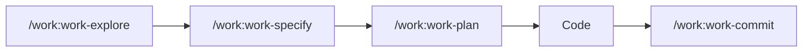

# Questions Fréquentes (FAQ)

Retrouvez ici les réponses aux questions les plus courantes sur claude-socle.

## Questions Générales

### Qu'est-ce que claude-socle ?

**claude-socle** est un template de configuration pour Claude Code qui fournit :
- **119 commandes** organisées par domaine (WORK, DEV, QA, OPS, etc.)
- **57 agents** spécialisés avec contexte isolé
- **41 skills** à déclenchement automatique
- **21 rules** contextuelles par langage
- Un workflow structuré : **Explore → Plan → TDD → Commit**

### Quelle différence avec Claude Code standard ?

| Aspect | Claude Code standard | claude-socle |
|--------|---------------------|--------------|
| Commandes | Commandes de base | 119 commandes spécialisées |
| Workflow | Libre | Structuré (Explore → Plan → TDD) |
| Agents | Non | 57 agents avec contexte isolé |
| Skills | Non | 41 skills automatiques |
| Rules | Manuelles | 21 rules par langage |
| Templates | Non | Spec, Plan, Tasks |

### Comment installer claude-socle ?

```bash
# Cloner le repository
git clone https://github.com/christopherlouet/claude-socle.git

# Copier les fichiers de configuration
cp -r claude-socle/.claude/ votre-projet/
cp claude-socle/CLAUDE.md votre-projet/
cp claude-socle/.mcp.json votre-projet/

# Ou utiliser le script d'installation
./claude-socle/scripts/new-project.sh --simple .
```

Voir le guide [Installation](/docs/intro/installation) pour plus de détails.

### Comment mettre à jour claude-socle ?

```bash
# Dans le dossier claude-socle
git pull origin main

# Copier les fichiers mis à jour
cp -r .claude/ votre-projet/
cp CLAUDE.md votre-projet/
```

:::tip Personnalisations
Si vous avez personnalisé des commandes, faites un diff avant de copier pour ne pas perdre vos modifications.
:::

### Où trouver de l'aide ?

1. **Documentation** : Ce site (vous y êtes !)
2. **FAQ** : Cette page
3. **Troubleshooting** : [Guide de dépannage](/docs/guides/troubleshooting)
4. **GitHub Issues** : [Signaler un problème](https://github.com/christopherlouet/claude-socle/issues)

---

## Commands

### Ma commande retourne "not found"

**Problème** : `/ma-commande` retourne une erreur "commande non trouvée".

**Causes possibles** :
1. Le dossier `.claude/commands/` n'existe pas dans votre projet
2. Le fichier de commande n'existe pas
3. Erreur de syntaxe dans le fichier de commande

**Solution** :
```bash
# Vérifier que .claude/commands existe
ls -la .claude/commands/

# Vérifier que la commande existe
ls -la .claude/commands/dev/  # Par exemple

# Si manquant, recopier depuis claude-socle
cp -r chemin/vers/claude-socle/.claude/commands/ .claude/
```

### Comment créer une commande personnalisée ?

Créez un fichier markdown dans `.claude/commands/` :

```markdown
# .claude/commands/custom/my-command.md

# Ma Commande Personnalisée

## Description
Cette commande fait X et Y.

## Instructions
1. Analyser le contexte
2. Effectuer l'action X
3. Retourner le résultat

## Output attendu
- Format du résultat
- Exemples
```

La commande sera disponible via `/my-command`.

### Quelle commande utiliser pour mon besoin ?

Utilisez l'**orchestrateur** :

```bash
/assistant "Décris ton besoin ici"
```

L'orchestrateur analysera votre demande et recommandera les commandes appropriées.

Ou consultez le [guide de décision](/docs/reference/cheatsheet).

### Comment voir toutes les commandes disponibles ?

```bash
# Dans Claude Code
/help

# Ou lister les fichiers
ls -la .claude/commands/
ls -la .claude/commands/*/
```

Ou consultez la [référence des commandes](/docs/commands).

### Les commandes sont-elles modifiables ?

**Oui !** Les commandes sont des fichiers markdown dans `.claude/commands/`. Vous pouvez :
- Modifier le comportement existant
- Ajouter des instructions spécifiques
- Créer de nouvelles commandes

:::warning Mises à jour
Vos modifications seront écrasées lors des mises à jour de claude-socle. Gardez une copie de vos personnalisations.
:::

---

## Agents & Skills

### Quelle est la différence entre Agent et Skill ?

| Aspect | Agent | Skill |
|--------|-------|-------|
| Déclenchement | Automatique par Claude | Automatique par mots-clés |
| Contexte | **Isolé** (nouvelle conversation) | **Partagé** (même conversation) |
| Outils | Restreints (ex: lecture seule) | Tous les outils |
| Usage | Tâches complexes, audits | Instructions enrichies |

**Agent** : Claude délègue à un sous-agent spécialisé.
**Skill** : Claude enrichit ses instructions avec le skill.

### Mon agent ne se déclenche pas

**Causes possibles** :
1. Le dossier `.claude/agents/` n'existe pas
2. Les mots-clés ne correspondent pas
3. Claude a choisi une autre approche

**Solution** :
```bash
# Vérifier que les agents existent
ls -la .claude/agents/

# Forcer l'utilisation d'un agent spécifique
# En mentionnant explicitement dans votre demande :
"Utilise l'agent qa-security pour faire un audit de sécurité"
```

### Comment forcer un agent spécifique ?

Mentionnez explicitement l'agent dans votre demande :

```bash
"Fais un audit de sécurité en utilisant l'agent qa-security"

# Ou utilisez la commande correspondante
/qa:qa-security
```

### Haiku vs Sonnet pour les agents ?

| Modèle | Caractéristiques | Agents typiques |
|--------|-----------------|-----------------|
| **Haiku** | Rapide, économique | Exploration, docs, lint |
| **Sonnet** | Plus intelligent | Audits complexes, debugging |

Les agents sont pré-configurés avec le modèle optimal. Vous n'avez pas à choisir.

### Comment créer un skill personnalisé ?

Créez un fichier dans `.claude/skills/` :

```yaml
# .claude/skills/my-skill.md
---
description: Mon skill personnalisé
triggers:
  - "mon mot-clé"
  - "autre déclencheur"
---

# Mon Skill

## Instructions
Quand ce skill est activé, tu dois :
1. Faire X
2. Faire Y
```

---

## Workflow

### Quel est l'ordre des commandes dans un workflow ?

Le workflow recommandé :



1. **Explore** - Comprendre le code existant
2. **Specify** - Définir les user stories (optionnel)
3. **Plan** - Planifier l'implémentation
4. **Code** - Développer (`/dev:dev-*`)
5. **Commit** - Créer un commit propre

### Puis-je sauter des étapes ?

**Oui**, mais avec prudence :

| Situation | Étapes à garder |
|-----------|-----------------|
| Petit fix | Explore → TDD → Commit |
| Feature simple | Explore → Plan → TDD → Commit |
| Feature complexe | Toutes les étapes |
| Nouveau sur le projet | Toujours Explore d'abord |

:::warning Explorer d'abord
Sautez `/work:work-explore` à vos risques et périls. Comprendre le code existant évite les incohérences.
:::

### Comment reprendre un workflow interrompu ?

Claude garde le contexte de la conversation. Vous pouvez :

1. **Continuer naturellement** : "Continue avec l'implémentation"
2. **Reprendre une étape** : "Reprenons le plan"
3. **Voir l'état** : "Où en sommes-nous ?"

Si vous avez fermé Claude Code, recommencez par `/work:work-explore` pour récupérer le contexte.

### Quelle commande utiliser en premier ?

**Toujours `/work:work-explore`** pour un nouveau projet ou une nouvelle feature.

Pour des tâches simples sur un projet connu :
- Bug simple → `/dev:dev-debug`
- Commit → `/work:work-commit`
- Question → `/doc:doc-explain`

### Comment documenter mon workflow ?

Le workflow génère automatiquement de la documentation dans `specs/` :

```
specs/ma-feature/
├── spec.md     # /work:work-specify
├── plan.md     # /work:work-plan
└── tasks.md    # /work:work-plan
```

Ces fichiers sont versionnables et servent de documentation.

---

## Problèmes Courants

### Claude ne suit pas mes instructions

**Causes possibles** :
1. Instructions trop vagues
2. Conflit avec les rules existantes
3. Contexte insuffisant

**Solutions** :
- Soyez plus spécifique dans votre demande
- Utilisez `/work:work-explore` d'abord
- Mentionnez explicitement les contraintes

### Les tests ne passent pas après une modification

**Actions** :
1. Vérifier que les tests étaient passants avant
2. Lancer `/dev:dev-debug` pour investiguer
3. Utiliser `/qa:qa-coverage` pour voir la couverture

### Le build est cassé

```bash
# Vérifier le build
npm run build

# Utiliser l'agent de debug
/dev:dev-debug "Le build échoue avec l'erreur X"

# Vérifier les dépendances
/ops:ops-deps
```

### Je ne comprends pas le code existant

```bash
# Explorer le codebase
/work:work-explore "Comprendre l'architecture générale"

# Expliquer un fichier spécifique
/doc:doc-explain "Explique le fichier src/services/auth.ts"

# Onboarding complet
/doc:doc-onboard
```

---

## Ressources Supplémentaires

- [Troubleshooting](/docs/guides/troubleshooting) - Erreurs et diagnostics
- [Tutoriels](/docs/tutorials) - Guides pas-à-pas
- [Reference](/docs/reference/cheatsheet) - Cheatsheet rapide
- [GitHub Issues](https://github.com/christopherlouet/claude-socle/issues) - Signaler un problème

---

:::info Question non listée ?
Si votre question n'est pas ici, consultez le [troubleshooting](/docs/guides/troubleshooting) ou [ouvrez une issue](https://github.com/christopherlouet/claude-socle/issues).
:::
