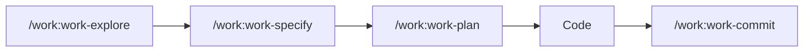

# Frequently Asked Questions (FAQ)

Find here the answers to the most common questions about claude-base.

## General Questions

### What is claude-base?

**claude-base** is a configuration template for Claude Code that provides:
- **<!-- count:commands -->128<!-- /count --> commands** organized by domain (WORK, DEV, QA, OPS, etc.)
- **<!-- count:agents -->55<!-- /count --> agents** specialized with isolated context
- **<!-- count:skills -->53<!-- /count --> skills** with automatic triggering
- **<!-- count:rules -->31<!-- /count --> rules** contextual per language
- A structured workflow: **Explore → Specify → Plan → TDD → Audit → Commit**

### What's the difference with standard Claude Code?

| Aspect | Standard Claude Code | claude-base |
|--------|---------------------|--------------|
| Commands | Basic commands | <!-- count:commands -->128<!-- /count --> specialized commands |
| Workflow | Free | Structured (Explore → Plan → TDD) |
| Agents | No | <!-- count:agents -->55<!-- /count --> agents with isolated context |
| Skills | No | <!-- count:skills -->53<!-- /count --> automatic skills |
| Rules | Manual | <!-- count:rules -->31<!-- /count --> rules per language |
| Templates | No | Spec, Plan, Tasks |

### How to install claude-base?

```bash
# Clone the repository
git clone https://github.com/christopherlouet/claude-base.git

# Copy the configuration files
cp -r claude-base/.claude/ your-project/
cp claude-base/CLAUDE.md your-project/
cp claude-base/.mcp.json your-project/

# Or use the installation script
./claude-base/scripts/new-project.sh --simple .
```

See the [Installation](/docs/intro/installation) guide for more details.

### How to update claude-base?

```bash
# In the claude-base folder
git pull origin main

# Copy the updated files
cp -r .claude/ your-project/
cp CLAUDE.md your-project/
```

:::tip Customizations
If you have customized commands, run a diff before copying so you don't lose your modifications.
:::

### Where to find help?

1. **Documentation**: This site (you're here!)
2. **FAQ**: This page
3. **Troubleshooting**: [Troubleshooting guide](/docs/guides/troubleshooting)
4. **GitHub Issues**: [Report an issue](https://github.com/christopherlouet/claude-base/issues)

---

## Commands

### My command returns "not found"

**Problem**: `/my-command` returns a "command not found" error.

**Possible causes**:
1. The `.claude/commands/` folder doesn't exist in your project
2. The command file doesn't exist
3. Syntax error in the command file

**Solution**:
```bash
# Check that .claude/commands exists
ls -la .claude/commands/

# Check that the command exists
ls -la .claude/commands/dev/  # For example

# If missing, copy back from claude-base
cp -r path/to/claude-base/.claude/commands/ .claude/
```

### How to create a custom command?

Create a markdown file in `.claude/commands/`:

```markdown
# .claude/commands/custom/my-command.md

# My Custom Command

## Description
This command does X and Y.

## Instructions
1. Analyze the context
2. Perform action X
3. Return the result

## Expected output
- Result format
- Examples
```

The command will be available via `/my-command`.

### Which command to use for my need?

Use the **orchestrator**:

```bash
/assistant "Describe your need here"
```

The orchestrator will analyze your request and recommend the appropriate commands.

Or consult the [decision guide](/docs/reference/commands).

### How to see all available commands?

```bash
# In Claude Code
/help

# Or list the files
ls -la .claude/commands/
ls -la .claude/commands/*/
```

Or consult the [commands reference](/docs/commands).

### Are the commands modifiable?

**Yes!** Commands are markdown files in `.claude/commands/`. You can:
- Modify the existing behavior
- Add specific instructions
- Create new commands

:::warning Updates
Your modifications will be overwritten during claude-base updates. Keep a copy of your customizations.
:::

---

## Agents & Skills

### What's the difference between Agent and Skill?

| Aspect | Agent | Skill |
|--------|-------|-------|
| Triggering | Automatic by Claude | Automatic by keywords |
| Context | **Isolated** (new conversation) | **Shared** (same conversation) |
| Tools | Restricted (e.g.: read-only) | All tools |
| Usage | Complex tasks, audits | Enriched instructions |

**Agent**: Claude delegates to a specialized sub-agent.
**Skill**: Claude enriches its instructions with the skill.

### My agent doesn't trigger

**Possible causes**:
1. The `.claude/agents/` folder doesn't exist
2. The keywords don't match
3. Claude chose another approach

**Solution**:
```bash
# Check that the agents exist
ls -la .claude/agents/

# Force the use of a specific agent
# By explicitly mentioning in your request:
"Use the qa-security agent to do a security audit"
```

### How to force a specific agent?

Explicitly mention the agent in your request:

```bash
"Do a security audit using the qa-security agent"

# Or use the corresponding command
/qa:qa-security
```

### Haiku vs Sonnet for agents?

| Model | Characteristics | Typical agents |
|--------|-----------------|-----------------|
| **Haiku** | Fast, economical | Exploration, docs, lint |
| **Sonnet** | Smarter | Complex audits, debugging |

Agents are pre-configured with the optimal model. You don't have to choose.

### How to create a custom skill?

Create a file in `.claude/skills/`:

```yaml
# .claude/skills/my-skill.md
---
description: My custom skill
triggers:
  - "my keyword"
  - "other trigger"
---

# My Skill

## Instructions
When this skill is activated, you must:
1. Do X
2. Do Y
```

---

## Workflow

### What is the order of commands in a workflow?

The recommended workflow:



1. **Explore** - Understand the existing code
2. **Specify** - Define user stories (optional)
3. **Plan** - Plan the implementation
4. **Code** - Develop (`/dev:dev-*`)
5. **Commit** - Create a clean commit

### Can I skip steps?

**Yes**, but with caution:

| Situation | Steps to keep |
|-----------|-----------------|
| Small fix | Explore → TDD → Commit |
| Simple feature | Explore → Specify → Plan → TDD → Audit → Commit |
| Complex feature | All steps |
| New on the project | Always Explore first |

:::warning Explore first
Skip `/work:work-explore` at your own risk. Understanding the existing code prevents inconsistencies.
:::

### How to resume an interrupted workflow?

Claude keeps the conversation context. You can:

1. **Continue naturally**: "Continue with the implementation"
2. **Resume a step**: "Let's resume the plan"
3. **See the state**: "Where are we?"

If you closed Claude Code, restart with `/work:work-explore` to recover the context.

### Which command to use first?

**Always `/work:work-explore`** for a new project or a new feature.

For simple tasks on a known project:
- Simple bug → `/dev:dev-debug`
- Commit → `/work:work-commit`
- Question → `/doc:doc-explain`

### How to document my workflow?

The workflow automatically generates documentation in `specs/`:

```
specs/my-feature/
├── spec.md     # /work:work-specify
├── plan.md     # /work:work-plan
└── tasks.md    # /work:work-plan
```

These files are versionable and serve as documentation.

---

## Common Problems

### Claude doesn't follow my instructions

**Possible causes**:
1. Instructions too vague
2. Conflict with existing rules
3. Insufficient context

**Solutions**:
- Be more specific in your request
- Use `/work:work-explore` first
- Explicitly mention the constraints

### Tests don't pass after a modification

**Actions**:
1. Check that the tests were passing before
2. Run `/dev:dev-debug` to investigate
3. Use `/qa:qa-coverage` to see the coverage

### The build is broken

```bash
# Check the build
npm run build

# Use the debug agent
/dev:dev-debug "The build fails with error X"

# Check the dependencies
/ops:ops-deps
```

### I don't understand the existing code

```bash
# Explore the codebase
/work:work-explore "Understand the general architecture"

# Explain a specific file
/doc:doc-explain "Explain the file src/services/auth.ts"

# Full onboarding
/doc:doc-onboard
```

---

## Additional Resources

- [Troubleshooting](/docs/guides/troubleshooting) - Errors and diagnostics
- [Tutorials](/docs/tutorials) - Step-by-step guides
- [Reference](/docs/reference/commands) - Quick cheatsheet
- [GitHub Issues](https://github.com/christopherlouet/claude-base/issues) - Report an issue

---

:::info Question not listed?
If your question isn't here, consult the [troubleshooting](/docs/guides/troubleshooting) or [open an issue](https://github.com/christopherlouet/claude-base/issues).
:::
