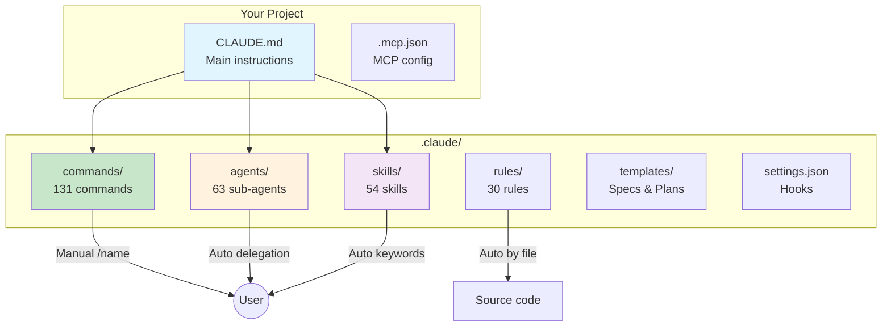
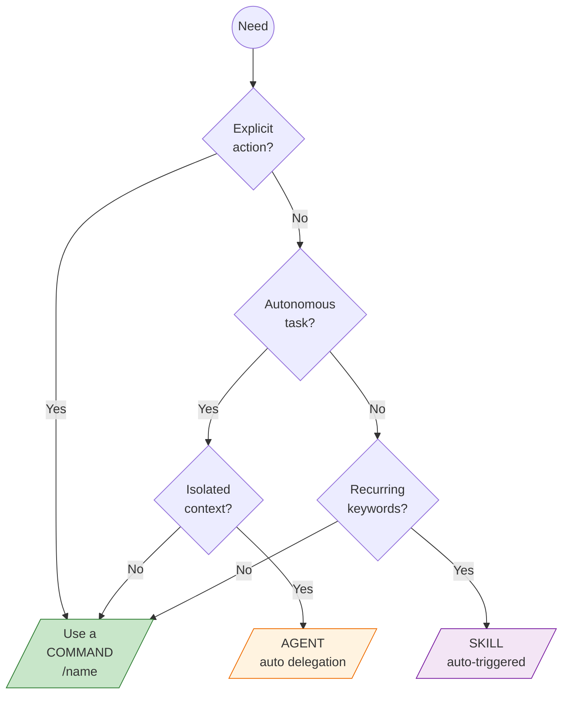

import FeatureComparison from '@site/src/components/FeatureComparison';

# Architecture

claude-base is composed of several types of components that work together to help you be more productive.

## Overview



### File structure

```
claude-base/
├── .claude/
│   ├── commands/       # 131 manual commands (/name)
│   │   ├── work/       # Main workflow
│   │   ├── dev/        # Development
│   │   ├── qa/         # Quality
│   │   ├── ops/        # Operations
│   │   ├── doc/        # Documentation
│   │   ├── biz/        # Business
│   │   ├── growth/     # Growth
│   │   ├── data/       # Data
│   │   └── legal/      # Legal
│   ├── agents/         # 63 autonomous sub-agents
│   ├── skills/         # 54 auto-triggered skills
│   ├── rules/          # 30 rules per technology
│   ├── templates/      # Spec/plan templates
│   ├── output-styles/  # Output styles
│   └── settings.json   # Configuration and hooks
├── CLAUDE.md           # Main instructions
└── .mcp.json           # MCP servers configuration
```

## Main components

### Presets (<!-- count:presets -->11<!-- /count -->)

**Presets** are stack-specific bundles that, on `claude-base init --preset <name>`, configure the foundation (skills filter, defaults, vendor pointers) for one specific stack.

**Three tiers:**
- **`maintainer-vouched`** (6) : maintainer uses the stack in production ≥3 months. Opinionated foundation filter + curated `marketplacePlugins` + `recommendedVendorSkills`.
- **`vendor-pointer`** (5) : thin pointer-only manifests where authority comes from the vendor (validated via marketplace-audit methodology). No foundation filter, no marketplace plugins, no defaults overrides.
- **`community-curated`** (0 instances) : contributor with signed maintenance commitment.

**Discoverability:** when `claude-base init` runs on an empty directory without `--preset` / `--type` and auto-detection produces no match, a pre-prompt asks "What are you building?" with an 8-entry intent taxonomy and filters the subsequent menu accordingly. Each preset opts in by declaring `categories: [string]` in its manifest (strict enum, validated).

**Cross-tool entry point:** the foundation ships an `AGENTS.md` at repo root signaling SKILL.md open-standard compliance to Codex / Cursor / Copilot / Gemini CLI. Skills under `.claude/skills/` are theoretically portable in form ; Claude-specific extensions (`allowed-tools`, `context: fork`, `model`) are silently ignored by other tools.

### Commands (<!-- count:commands -->126<!-- /count -->)

**Commands** are instructions triggered manually with `/name`.

**Characteristics:**
- Manual and explicit triggering
- Context shared with the conversation
- All tools available
- `.md` files in `.claude/commands/`

**Example:**
```bash
/work:work-explore
/dev:dev-tdd "Implement the user service"
/qa:qa-security
```

### Agents (<!-- count:agents -->48<!-- /count -->)

**Agents** are autonomous sub-agents with an isolated context.

**Characteristics:**
- Automatic triggering by delegation
- Isolated context (does not pollute the conversation)
- Restricted tools (read-only for some)
- Specific model (haiku or sonnet)

**Delegation example:**
```
"Run a security audit" → Claude delegates to the qa-security agent (sonnet)
"Explore the auth code" → Claude delegates to the work-explore agent (haiku)
```

### Skills (<!-- count:skills -->53<!-- /count -->)

**Skills** are auto-triggered by keywords in the conversation.

**Characteristics:**
- Automatic triggering on keywords
- Forked (isolated) or shared context
- Restricted tools via `allowed-tools`
- `SKILL.md` files in `.claude/skills/`

**Triggering example:**
```
"I want to do TDD" → test-driven-development skill activated
"Make a commit" → generating-commit-messages skill activated
```

### Rules (<!-- count:rules -->31<!-- /count -->)

**Rules** are rules applied by file path.

**Characteristics:**
- Automatic application based on the file
- Specific paths (e.g., `**/*.tsx`, `**/api/**`)
- Code conventions per technology

**Example:**
```yaml
---
paths:
  - "**/*.ts"
  - "**/*.tsx"
---
# TypeScript rules applied to these files
```

## Comparison

<FeatureComparison />

## When to use what?



### Use a Command when:
- You want an explicit and controlled action
- You need all the tools
- The conversation context is important

### Use an Agent when:
- The task can be autonomous
- You want to isolate the context
- The task is standardized (audit, exploration)

### Use a Skill when:
- The action is recurring and contextual
- The keywords are specific
- You want automatic triggering

## Models used

| Model | Usage | Agents |
|-------|-------|--------|
| **Haiku** | Fast, economical tasks | work-explore, doc-onboard, wcag-audit |
| **Sonnet** | Complex tasks, analyses | qa-security, qa-audit, dev-debug |
| **Opus** | Maximum capabilities | (Not used by default) |

## Hooks and automations

The `.claude/settings.json` file configures automatic hooks:

```json
{
  "hooks": {
    "PreToolUse": [
      {
        "matcher": "Edit|Write",
        "command": "scripts/validate.sh protect-main"
      }
    ],
    "PostToolUse": [
      {
        "matcher": "Edit|Write",
        "command": "scripts/validate.sh auto-format $FILE_PATH"
      }
    ]
  }
}
```

**Available hooks:**
- **Main protection**: Blocks modifications on main/master
- **Auto-format**: Prettier on TS/JS files
- **Type-check**: TypeScript verification
- **Auto-install**: npm install after modification of package.json

## MCP configuration

The `.mcp.json` file configures MCP (Model Context Protocol) servers:

```json
{
  "mcpServers": {
    "filesystem": { "enabled": false },
    "memory": { "enabled": false },
    "github": { "enabled": false }
  }
}
```

Enable the servers as needed to extend Claude's capabilities.

## Next steps

- [Installation](/docs/intro/installation) - Complete installation guide
- [Workflows](/docs/workflow) - See the workflows in action
- [Commands](/docs/commands) - Explore the <!-- count:commands -->126<!-- /count --> commands
