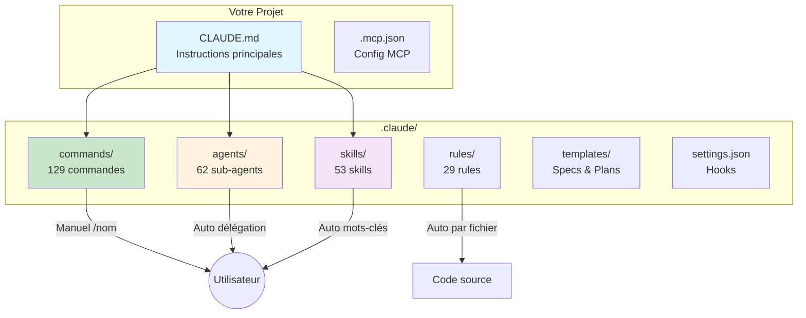
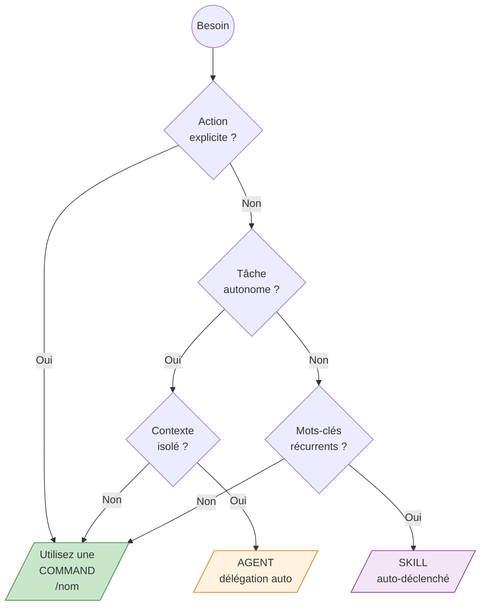

import FeatureComparison from '@site/src/components/FeatureComparison';

# Architecture

claude-socle est compose de plusieurs types de composants qui travaillent ensemble pour vous aider a etre plus productif.

## Vue d'ensemble



### Structure des fichiers

```
claude-socle/
├── .claude/
│   ├── commands/       # 129 commandes manuelles (/nom)
│   │   ├── work/       # Workflow principal
│   │   ├── dev/        # Developpement
│   │   ├── qa/         # Qualite
│   │   ├── ops/        # Operations
│   │   ├── doc/        # Documentation
│   │   ├── biz/        # Business
│   │   ├── growth/     # Croissance
│   │   ├── data/       # Donnees
│   │   └── legal/      # Legal
│   ├── agents/         # 62 sub-agents autonomes
│   ├── skills/         # 53 skills auto-declenches
│   ├── rules/          # 26 regles par technologie
│   ├── templates/      # Templates de specs/plans
│   ├── output-styles/  # Styles de sortie
│   └── settings.json   # Configuration et hooks
├── CLAUDE.md           # Instructions principales
└── .mcp.json           # Configuration MCP servers
```

## Composants principaux

### Commands (129)

Les **commands** sont des instructions declenchees manuellement avec `/nom`.

**Caracteristiques :**
- Declenchement manuel et explicite
- Contexte partage avec la conversation
- Tous les outils disponibles
- Fichiers `.md` dans `.claude/commands/`

**Exemple :**
```bash
/work:work-explore
/dev:dev-tdd "Implementer le service utilisateur"
/qa:qa-security
```

### Agents (62)

Les **agents** sont des sub-agents autonomes avec un contexte isole.

**Caracteristiques :**
- Declenchement automatique par delegation
- Contexte isole (ne pollue pas la conversation)
- Outils restreints (lecture seule pour certains)
- Modele specifique (haiku ou sonnet)

**Exemple de delegation :**
```
"Fais un audit de securite" → Claude delegue a l'agent qa-security (sonnet)
"Explore le code d'auth" → Claude delegue a l'agent work-explore (haiku)
```

### Skills (54)

Les **skills** sont auto-declenches par des mots-cles dans la conversation.

**Caracteristiques :**
- Declenchement automatique sur mots-cles
- Contexte fork (isole) ou partage
- Outils restreints via `allowed-tools`
- Fichiers `SKILL.md` dans `.claude/skills/`

**Exemple de declenchement :**
```
"Je veux faire du TDD" → Skill test-driven-development active
"Fais un commit" → Skill generating-commit-messages active
```

### Rules (30)

Les **rules** sont des regles appliquees par chemin de fichier.

**Caracteristiques :**
- Application automatique selon le fichier
- Paths specifiques (ex: `**/*.tsx`, `**/api/**`)
- Conventions de code par technologie

**Exemple :**
```yaml
---
paths:
  - "**/*.ts"
  - "**/*.tsx"
---
# Regles TypeScript appliquees a ces fichiers
```

## Comparaison

<FeatureComparison />

## Quand utiliser quoi ?



### Utilisez une Command quand :
- Vous voulez une action explicite et controlee
- Vous avez besoin de tous les outils
- Le contexte de conversation est important

### Utilisez un Agent quand :
- La tache peut etre autonome
- Vous voulez isoler le contexte
- La tache est standardisee (audit, exploration)

### Utilisez un Skill quand :
- L'action est recurrente et contextuelle
- Les mots-cles sont specifiques
- Vous voulez un declenchement automatique

## Modeles utilises

| Modele | Usage | Agents |
|--------|-------|--------|
| **Haiku** | Taches rapides, economiques | work-explore, doc-onboard, wcag-audit |
| **Sonnet** | Taches complexes, analyses | qa-security, qa-audit, dev-debug |
| **Opus** | Maximum de capacites | (Non utilise par defaut) |

## Hooks et automatisations

Le fichier `.claude/settings.json` configure des hooks automatiques :

```json
{
  "hooks": {
    "PreToolUse": [
      {
        "matcher": "Edit|Write",
        "command": "scripts/validate.sh protect-main"
      }
    ],
    "PostToolUse": [
      {
        "matcher": "Edit|Write",
        "command": "scripts/validate.sh auto-format $FILE_PATH"
      }
    ]
  }
}
```

**Hooks disponibles :**
- **Protection main** : Bloque les modifications sur main/master
- **Auto-format** : Prettier sur fichiers TS/JS
- **Type-check** : Verification TypeScript
- **Auto-install** : npm install apres modification de package.json

## Configuration MCP

Le fichier `.mcp.json` configure les serveurs MCP (Model Context Protocol) :

```json
{
  "mcpServers": {
    "filesystem": { "enabled": false },
    "memory": { "enabled": false },
    "github": { "enabled": false }
  }
}
```

Activez les serveurs selon vos besoins pour etendre les capacites de Claude.

## Prochaines etapes

- [Installation](/docs/intro/installation) - Guide d'installation complet
- [Workflows](/docs/workflow) - Voir les workflows en action
- [Commands](/docs/commands) - Explorer les 129 commandes
