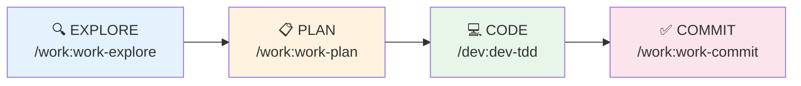

# Cheatsheet

> Aide-memoire rapide - imprimable format A4

## Workflow principal



## Commandes essentielles

| Commande | Usage |
|----------|-------|
| `/assistant` | Guide complet, aide au choix (avec confirmation) |
| `/assistant-auto` | Execution automatique du workflow adapte |
| `/work:work-explore` | Comprendre le code |
| `/work:work-plan` | Planifier les changements |
| `/dev:dev-tdd` | Developper en TDD |
| `/work:work-commit` | Commit propre |
| `/work:work-pr` | Pull Request |
| `/qa:qa-audit` | Audit complet |

## Workflows pre-definis

| Commande | Pour |
|----------|------|
| `/work:work-flow-feature` | Nouvelle feature |
| `/work:work-flow-bugfix` | Correction bug |
| `/work:work-flow-release` | Preparer release |
| `/work:work-flow-launch` | Lancer produit |

## Par domaine

### WORK (Workflow)
```bash
/work:work-explore      # Comprendre
/work:work-plan         # Planifier
/work:work-commit       # Commiter
/work:work-pr           # Pull Request
```

### DEV (Developpement)
```bash
/dev:dev-tdd           # TDD
/dev:dev-test          # Tests
/dev:dev-debug         # Debug
/dev:dev-api           # API REST
/dev:dev-component     # Composant UI
```

### QA (Qualite)
```bash
/qa:qa-review         # Code review
/qa:qa-security       # Securite OWASP
/qa:qa-perf           # Performance
/qa:qa-a11y           # Accessibilite
/qa:qa-audit          # Audit complet
```

### OPS (Operations)
```bash
/ops:ops-release       # Release
/ops:ops-hotfix        # Hotfix urgent
/ops:ops-ci            # CI/CD
/ops:ops-docker        # Docker
/ops:ops-monitoring    # Monitoring
```

### DOC (Documentation)
```bash
/doc:doc-changelog     # Changelog
/doc:doc-readme        # README
/doc:doc-api-spec      # OpenAPI
/doc:doc-architecture  # Architecture
```

### BIZ (Business)
```bash
/biz:biz-model         # Business model
/biz:biz-mvp           # Definition MVP
/biz:biz-pricing       # Pricing
/biz:biz-pitch         # Pitch deck
```

### GROWTH (Croissance)
```bash
/growth:growth-landing    # Landing page
/growth:growth-seo        # SEO
/growth:growth-analytics  # Analytics
/growth:growth-funnel     # Funnel
```

### LEGAL (Legal)
```bash
/legal:legal-rgpd        # RGPD
/legal:legal-terms-of-service   # CGU
/legal:legal-privacy-policy     # Privacy
```

## GitFlow

```bash
# Initialiser
/ops:ops-gitflow-init

# Feature
/ops:ops-gitflow-feature start "ma-feature"
/ops:ops-gitflow-feature finish "ma-feature"

# Release
/ops:ops-gitflow-release start "v1.0.0"
/ops:ops-gitflow-release finish "v1.0.0"

# Hotfix urgent
/ops:ops-gitflow-hotfix start "fix-critical"
/ops:ops-gitflow-hotfix finish "fix-critical"
```

## Composants

| Type | Nombre | Declenchement |
|------|--------|---------------|
| Commands | 121 | Manuel (`/nom`) |
| Agents | 57 | Automatique |
| Skills | 42 | Mots-cles |
| Rules | 21 | Par fichier |

## Modeles d'agents

| Modele | Usage | Vitesse |
|--------|-------|---------|
| Haiku | Taches simples | Rapide |
| Sonnet | Analyses complexes | Moyen |

## Format commit

```
type(scope): description

[corps optionnel]

[footer optionnel]
```

Types: `feat`, `fix`, `refactor`, `test`, `docs`, `style`, `chore`, `perf`

## Aide

```bash
# Point d'entree (mode guide, avec confirmation)
/assistant

# Choisir le bon workflow
/assistant "Comment faire X ?"

# Execution automatique (utilisateurs avances)
/assistant-auto "Ajouter une feature d'authentification"

# Documentation
https://christopherlouet.github.io/claude-socle/
```

---

**claude-socle** | 121 Commands | 57 Agents | 42 Skills | 21 Rules
