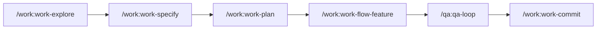

import DifficultyBadge from '@site/src/components/DifficultyBadge';

# First project with claude-base

<DifficultyBadge level="beginner" /> **Estimated duration: 15 minutes**

This tutorial walks you through creating your first feature using the **Explore → Specify → Plan → TDD → Audit → Commit** workflow.

## Goals

By the end of this tutorial, you will know how to:
- Use `/work:work-explore` to understand a codebase
- Use `/work:work-specify` to define user stories and acceptance criteria
- Use `/work:work-plan` to plan an implementation
- Use `/work:work-flow-feature` to create a complete feature
- Use `/qa:qa-loop` to audit and reach the target quality score
- Understand the development cycle with claude-base

## Prerequisites

- Claude Code installed and working
- An existing project or a new empty project

## Step 1: Explore the project

Before modifying anything, **always** start by exploring the existing code.

### Run the exploration command

```bash
/work:work-explore "Understand the overall architecture of the project"
```

### Expected result

Claude will analyze your project and present:
- The folder structure
- The technologies used
- The patterns and conventions in place
- The key files

**Example output:**

```
## Project analysis

### Structure
- Framework: Next.js 14 (App Router)
- Language: TypeScript
- Tests: Jest + React Testing Library
- Style: Tailwind CSS

### Identified conventions
- Components in /src/components
- Hooks in /src/hooks
- Services in /src/services
- Naming: PascalCase for components, camelCase for functions

### Points of attention
- No tests on existing hooks
- README documentation up to date
```

:::tip Why explore first?
Exploration lets you understand existing conventions and avoid introducing inconsistencies. Claude then adapts its suggestions to the project's style.
:::

## Step 2: Specify the feature

Before designing, define what the feature does and how you will know it's done.

### Run the specification

```bash
/work:work-specify "Add a dark theme button"
```

### Expected result

Claude will produce a structured specification with:
- Prioritized user stories (P1 = MVP, P2, P3)
- Acceptance criteria (Given/When/Then)
- Functional requirements and edge cases
- Out-of-scope explicitly listed

**Example output:**

```
## US-1 (P1) — Toggle dark theme

As a user, I want to toggle the theme between light and dark
so that I can read comfortably day and night.

Given the app is open, when I click the theme toggle,
then the interface switches theme and the choice persists across reloads.

## Edge cases
- First visit: respect prefers-color-scheme
- localStorage disabled: fallback to in-memory state
```

:::tip Why specify first?
A short spec catches scope misalignment before you invest in design or code. It is the cheapest place to change your mind.
:::

## Step 3: Plan the feature

Now that the scope is clear, plan the implementation.

### Run the planning

```bash
/work:work-plan
```

### Expected result

Claude will create a detailed plan with:
- The files to create/modify
- The implementation steps
- The potential risks

**Example output:**

```
## Implementation plan: Dark theme

### Files to create
- src/hooks/useTheme.ts - Theme management hook
- src/components/ThemeToggle.tsx - Toggle button

### Files to modify
- src/app/layout.tsx - Add the theme provider
- tailwind.config.ts - Enable dark mode

### Steps
1. Create the useTheme hook with localStorage
2. Create the ThemeToggle component
3. Integrate into the layout
4. Test manually

### Risks
- Theme flash on load (mitigated with inline script)
```

## Step 4: Implement with the full workflow

For an end-to-end guided implementation, use the feature workflow.

### Run the workflow

```bash
/work:work-flow-feature "Add a dark theme button"
```

### What happens

The workflow will automatically:
1. **Explore** the context if not already done
2. **Plan** the implementation
3. **Create** the necessary files
4. **Test** if tests exist
5. **Propose** a commit

### Follow the steps

Claude will guide you step by step. At each step, you can:
- **Validate** to continue
- **Modify** if you want to adjust
- **Cancel** if you change your mind

## Step 5: Verify the result

Once the workflow is complete, verify your work.

### Test manually

```bash
npm run dev
```

Open your browser and check that the theme button works.

### Check the created files

```bash
git status
```

You should see the new files and modifications.

## Step 6: Audit

Run the adaptive audit + fix loop until the target quality score is reached.

### Run the audit loop

```bash
/qa:qa-loop "score 90"
```

### What happens

Claude audits security (OWASP), performance (Core Web Vitals), accessibility (WCAG) and code quality, then fixes P0/P1 issues automatically and re-audits in a loop until the target score is reached.

:::caution Important
Do not commit until the target score is reached. TDD validates behavior, the audit validates overall quality.
:::

## Step 7: Commit

If everything is correct, create a clean commit.

### Use the commit command

```bash
/work:work-commit
```

### Expected result

Claude will:
1. Analyze the changes
2. Propose a Conventional Commits message
3. Create the commit after validation

**Example message:**

```
feat(theme): add dark mode toggle

- Add useTheme hook with localStorage persistence
- Add ThemeToggle component with sun/moon icons
- Integrate theme provider in root layout
```

## Recap

You have learned the basic workflow:



| Command | Usage |
|---------|-------|
| `/work:work-explore` | Understand the code before modifying |
| `/work:work-specify` | Define user stories and acceptance criteria |
| `/work:work-plan` | Plan before implementing |
| `/work:work-flow-feature` | Complete workflow for a feature |
| `/qa:qa-loop` | Adaptive audit + fix loop until target score |
| `/work:work-commit` | Clean commit with formatted message |

## Next steps

Now that you have mastered the basic workflow, continue with:

- [Tutorial 02: React Feature](/docs/tutorials/feature-react) - Create a complete component
- [Commands Guide](/docs/commands) - Explore all available commands
- [FAQ](/docs/guides/faq) - Answers to common questions

---

:::info Tip
Get into the habit of **always exploring before coding**. This discipline will save you from many errors and inconsistencies.
:::
