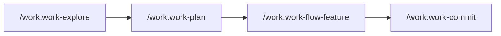

import DifficultyBadge from '@site/src/components/DifficultyBadge';

# Premier projet avec claude-socle

<DifficultyBadge level="beginner" /> **Durée estimée : 15 minutes**

Ce tutoriel vous guide dans la création de votre première feature en utilisant le workflow **Explore → Plan → TDD → Commit**.

## Objectifs

À la fin de ce tutoriel, vous saurez :
- Utiliser `/work:work-explore` pour comprendre un codebase
- Utiliser `/work:work-plan` pour planifier une implémentation
- Utiliser `/work:work-flow-feature` pour créer une feature complète
- Comprendre le cycle de développement avec claude-socle

## Prérequis

- Claude Code installé et fonctionnel
- Un projet existant ou un nouveau projet vide

## Étape 1 : Explorer le projet

Avant de modifier quoi que ce soit, commencez **toujours** par explorer le code existant.

### Lancez la commande d'exploration

```bash
/work:work-explore "Comprendre l'architecture générale du projet"
```

### Résultat attendu

Claude va analyser votre projet et vous présenter :
- La structure des dossiers
- Les technologies utilisées
- Les patterns et conventions en place
- Les fichiers clés

**Exemple de sortie :**

```
## Analyse du projet

### Structure
- Framework: Next.js 14 (App Router)
- Langage: TypeScript
- Tests: Jest + React Testing Library
- Style: Tailwind CSS

### Conventions identifiées
- Composants dans /src/components
- Hooks dans /src/hooks
- Services dans /src/services
- Naming: PascalCase pour composants, camelCase pour fonctions

### Points d'attention
- Pas de tests sur les hooks existants
- Documentation README à jour
```

:::tip Pourquoi explorer d'abord ?
L'exploration vous permet de comprendre les conventions existantes et d'éviter d'introduire des incohérences. Claude adapte ensuite ses suggestions au style du projet.
:::

## Étape 2 : Planifier la feature

Maintenant que vous comprenez le projet, planifiez votre feature.

### Lancez la planification

```bash
/work:work-plan "Ajouter un bouton de thème sombre"
```

### Résultat attendu

Claude va créer un plan détaillé avec :
- Les fichiers à créer/modifier
- Les étapes d'implémentation
- Les risques potentiels

**Exemple de sortie :**

```
## Plan d'implémentation : Thème sombre

### Fichiers à créer
- src/hooks/useTheme.ts - Hook de gestion du thème
- src/components/ThemeToggle.tsx - Bouton de toggle

### Fichiers à modifier
- src/app/layout.tsx - Ajouter le provider de thème
- tailwind.config.ts - Activer le mode dark

### Étapes
1. Créer le hook useTheme avec localStorage
2. Créer le composant ThemeToggle
3. Intégrer dans le layout
4. Tester manuellement

### Risques
- Flash de thème au chargement (mitigé avec script inline)
```

## Étape 3 : Implémenter avec le workflow complet

Pour une implémentation guidée de bout en bout, utilisez le workflow feature.

### Lancez le workflow

```bash
/work:work-flow-feature "Ajouter un bouton de thème sombre"
```

### Ce qui se passe

Le workflow va automatiquement :
1. **Explorer** le contexte si pas déjà fait
2. **Planifier** l'implémentation
3. **Créer** les fichiers nécessaires
4. **Tester** si des tests existent
5. **Proposer** un commit

### Suivez les étapes

Claude vous guidera étape par étape. À chaque étape, vous pouvez :
- **Valider** pour continuer
- **Modifier** si vous voulez ajuster
- **Annuler** si vous changez d'avis

## Étape 4 : Vérifier le résultat

Une fois le workflow terminé, vérifiez votre travail.

### Testez manuellement

```bash
npm run dev
```

Ouvrez votre navigateur et vérifiez que le bouton de thème fonctionne.

### Vérifiez les fichiers créés

```bash
git status
```

Vous devriez voir les nouveaux fichiers et modifications.

## Étape 5 : Commiter

Si tout est correct, créez un commit propre.

### Utilisez la commande commit

```bash
/work:work-commit
```

### Résultat attendu

Claude va :
1. Analyser les changements
2. Proposer un message de commit Conventional Commits
3. Créer le commit après validation

**Exemple de message :**

```
feat(theme): add dark mode toggle

- Add useTheme hook with localStorage persistence
- Add ThemeToggle component with sun/moon icons
- Integrate theme provider in root layout
```

## Récapitulatif

Vous avez appris le workflow de base :



| Commande | Usage |
|----------|-------|
| `/work:work-explore` | Comprendre le code avant de modifier |
| `/work:work-plan` | Planifier avant d'implémenter |
| `/work:work-flow-feature` | Workflow complet pour une feature |
| `/work:work-commit` | Commit propre avec message formaté |

## Prochaines étapes

Maintenant que vous maîtrisez le workflow de base, continuez avec :

- [Tutoriel 02 : Feature React](/docs/tutorials/feature-react) - Créer un composant complet
- [Guide Commands](/docs/commands) - Explorer toutes les commandes disponibles
- [FAQ](/docs/guides/faq) - Réponses aux questions courantes

---

:::info Conseil
Prenez l'habitude de **toujours explorer avant de coder**. Cette discipline vous évitera de nombreuses erreurs et incohérences.
:::
