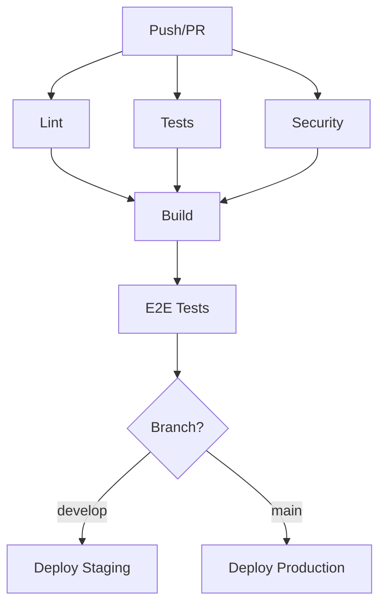

import DifficultyBadge from '@site/src/components/DifficultyBadge';

# Pipeline CI/CD avec GitHub Actions

<DifficultyBadge level="intermediate" /> **Durée estimée : 45 minutes**

Ce tutoriel vous montre comment configurer un pipeline CI/CD complet avec GitHub Actions pour automatiser tests, build et déploiement.

## Objectifs

À la fin de ce tutoriel, vous saurez :
- Utiliser `/ops-ci` pour créer un pipeline
- Configurer les tests automatisés
- Mettre en place le déploiement continu
- Gérer les secrets et environnements

## Prérequis

- Un repository GitHub
- Un projet Node.js/React (ou autre)
- Connaissance de base de Git

## Étape 1 : Créer le pipeline de base

```bash
/ops-ci "Pipeline CI/CD pour une app Next.js avec tests, lint et déploiement Vercel"
```

Claude va créer :

**`.github/workflows/ci.yml`**
```yaml
name: CI/CD Pipeline

on:
  push:
    branches: [main, develop]
  pull_request:
    branches: [main]

env:
  NODE_VERSION: '20'

jobs:
  # Job 1: Lint et vérification de types
  lint:
    name: Lint & Type Check
    runs-on: ubuntu-latest
    steps:
      - name: Checkout
        uses: actions/checkout@v4

      - name: Setup Node.js
        uses: actions/setup-node@v4
        with:
          node-version: ${{ env.NODE_VERSION }}
          cache: 'npm'

      - name: Install dependencies
        run: npm ci

      - name: Run ESLint
        run: npm run lint

      - name: Run TypeScript check
        run: npm run typecheck

  # Job 2: Tests unitaires
  test:
    name: Unit Tests
    runs-on: ubuntu-latest
    steps:
      - name: Checkout
        uses: actions/checkout@v4

      - name: Setup Node.js
        uses: actions/setup-node@v4
        with:
          node-version: ${{ env.NODE_VERSION }}
          cache: 'npm'

      - name: Install dependencies
        run: npm ci

      - name: Run tests with coverage
        run: npm run test:coverage

      - name: Upload coverage report
        uses: codecov/codecov-action@v4
        with:
          token: ${{ secrets.CODECOV_TOKEN }}
          files: ./coverage/lcov.info

  # Job 3: Build
  build:
    name: Build
    runs-on: ubuntu-latest
    needs: [lint, test]
    steps:
      - name: Checkout
        uses: actions/checkout@v4

      - name: Setup Node.js
        uses: actions/setup-node@v4
        with:
          node-version: ${{ env.NODE_VERSION }}
          cache: 'npm'

      - name: Install dependencies
        run: npm ci

      - name: Build
        run: npm run build

      - name: Upload build artifacts
        uses: actions/upload-artifact@v4
        with:
          name: build
          path: .next/
          retention-days: 7

  # Job 4: Déploiement (uniquement sur main)
  deploy:
    name: Deploy to Vercel
    runs-on: ubuntu-latest
    needs: build
    if: github.ref == 'refs/heads/main' && github.event_name == 'push'
    environment:
      name: production
      url: ${{ steps.deploy.outputs.url }}
    steps:
      - name: Checkout
        uses: actions/checkout@v4

      - name: Deploy to Vercel
        id: deploy
        uses: amondnet/vercel-action@v25
        with:
          vercel-token: ${{ secrets.VERCEL_TOKEN }}
          vercel-org-id: ${{ secrets.VERCEL_ORG_ID }}
          vercel-project-id: ${{ secrets.VERCEL_PROJECT_ID }}
          vercel-args: '--prod'
```

## Étape 2 : Ajouter les tests E2E

Ajoutons des tests Playwright au pipeline :

```bash
/qa-e2e "Configurer Playwright pour les tests E2E dans le pipeline CI"
```

**Ajout au workflow :**

```yaml
  # Job 5: Tests E2E
  e2e:
    name: E2E Tests
    runs-on: ubuntu-latest
    needs: build
    steps:
      - name: Checkout
        uses: actions/checkout@v4

      - name: Setup Node.js
        uses: actions/setup-node@v4
        with:
          node-version: ${{ env.NODE_VERSION }}
          cache: 'npm'

      - name: Install dependencies
        run: npm ci

      - name: Install Playwright browsers
        run: npx playwright install --with-deps

      - name: Download build artifacts
        uses: actions/download-artifact@v4
        with:
          name: build
          path: .next/

      - name: Run E2E tests
        run: npm run test:e2e

      - name: Upload test results
        if: failure()
        uses: actions/upload-artifact@v4
        with:
          name: playwright-report
          path: playwright-report/
          retention-days: 7
```

## Étape 3 : Ajouter l'audit de sécurité

```yaml
  # Job 6: Security audit
  security:
    name: Security Audit
    runs-on: ubuntu-latest
    steps:
      - name: Checkout
        uses: actions/checkout@v4

      - name: Setup Node.js
        uses: actions/setup-node@v4
        with:
          node-version: ${{ env.NODE_VERSION }}
          cache: 'npm'

      - name: Run npm audit
        run: npm audit --audit-level=high

      - name: Run Snyk security scan
        uses: snyk/actions/node@master
        continue-on-error: true
        env:
          SNYK_TOKEN: ${{ secrets.SNYK_TOKEN }}
```

## Étape 4 : Configurer les secrets

Dans GitHub, allez dans **Settings > Secrets and variables > Actions** :

| Secret | Description |
|--------|-------------|
| `VERCEL_TOKEN` | Token Vercel (Settings > Tokens) |
| `VERCEL_ORG_ID` | ID de votre organisation Vercel |
| `VERCEL_PROJECT_ID` | ID du projet Vercel |
| `CODECOV_TOKEN` | Token Codecov pour la couverture |
| `SNYK_TOKEN` | Token Snyk pour l'audit de sécurité |

## Étape 5 : Configurer les environnements

Créez des environnements pour les déploiements :

1. Allez dans **Settings > Environments**
2. Créez `production` et `staging`
3. Ajoutez les règles de protection :
   - Require reviewers for production
   - Restrict to specific branches

```yaml
  # Déploiement staging
  deploy-staging:
    name: Deploy to Staging
    runs-on: ubuntu-latest
    needs: build
    if: github.ref == 'refs/heads/develop'
    environment:
      name: staging
      url: ${{ steps.deploy.outputs.url }}
    steps:
      - name: Deploy to Vercel (Preview)
        uses: amondnet/vercel-action@v25
        with:
          vercel-token: ${{ secrets.VERCEL_TOKEN }}
          vercel-org-id: ${{ secrets.VERCEL_ORG_ID }}
          vercel-project-id: ${{ secrets.VERCEL_PROJECT_ID }}
```

## Étape 6 : Ajouter les badges

Ajoutez les badges de statut à votre README :

```markdown
# Mon Projet


[](https://codecov.io/gh/username/repo)
[](https://my-app.vercel.app)
```

## Étape 7 : Pipeline complet final

Voici le workflow complet :

```yaml
name: CI/CD Pipeline

on:
  push:
    branches: [main, develop]
  pull_request:
    branches: [main]

concurrency:
  group: ${{ github.workflow }}-${{ github.ref }}
  cancel-in-progress: true

env:
  NODE_VERSION: '20'

jobs:
  lint:
    name: Lint & Type Check
    runs-on: ubuntu-latest
    steps:
      - uses: actions/checkout@v4
      - uses: actions/setup-node@v4
        with:
          node-version: ${{ env.NODE_VERSION }}
          cache: 'npm'
      - run: npm ci
      - run: npm run lint
      - run: npm run typecheck

  test:
    name: Unit Tests
    runs-on: ubuntu-latest
    steps:
      - uses: actions/checkout@v4
      - uses: actions/setup-node@v4
        with:
          node-version: ${{ env.NODE_VERSION }}
          cache: 'npm'
      - run: npm ci
      - run: npm run test:coverage
      - uses: codecov/codecov-action@v4
        with:
          token: ${{ secrets.CODECOV_TOKEN }}

  security:
    name: Security Audit
    runs-on: ubuntu-latest
    steps:
      - uses: actions/checkout@v4
      - uses: actions/setup-node@v4
        with:
          node-version: ${{ env.NODE_VERSION }}
          cache: 'npm'
      - run: npm audit --audit-level=high

  build:
    name: Build
    runs-on: ubuntu-latest
    needs: [lint, test, security]
    steps:
      - uses: actions/checkout@v4
      - uses: actions/setup-node@v4
        with:
          node-version: ${{ env.NODE_VERSION }}
          cache: 'npm'
      - run: npm ci
      - run: npm run build
      - uses: actions/upload-artifact@v4
        with:
          name: build
          path: .next/

  e2e:
    name: E2E Tests
    runs-on: ubuntu-latest
    needs: build
    steps:
      - uses: actions/checkout@v4
      - uses: actions/setup-node@v4
        with:
          node-version: ${{ env.NODE_VERSION }}
          cache: 'npm'
      - run: npm ci
      - run: npx playwright install --with-deps
      - uses: actions/download-artifact@v4
        with:
          name: build
          path: .next/
      - run: npm run test:e2e
      - uses: actions/upload-artifact@v4
        if: failure()
        with:
          name: playwright-report
          path: playwright-report/

  deploy-staging:
    name: Deploy Staging
    runs-on: ubuntu-latest
    needs: [build, e2e]
    if: github.ref == 'refs/heads/develop'
    environment:
      name: staging
    steps:
      - uses: actions/checkout@v4
      - uses: amondnet/vercel-action@v25
        with:
          vercel-token: ${{ secrets.VERCEL_TOKEN }}
          vercel-org-id: ${{ secrets.VERCEL_ORG_ID }}
          vercel-project-id: ${{ secrets.VERCEL_PROJECT_ID }}

  deploy-production:
    name: Deploy Production
    runs-on: ubuntu-latest
    needs: [build, e2e]
    if: github.ref == 'refs/heads/main' && github.event_name == 'push'
    environment:
      name: production
    steps:
      - uses: actions/checkout@v4
      - uses: amondnet/vercel-action@v25
        with:
          vercel-token: ${{ secrets.VERCEL_TOKEN }}
          vercel-org-id: ${{ secrets.VERCEL_ORG_ID }}
          vercel-project-id: ${{ secrets.VERCEL_PROJECT_ID }}
          vercel-args: '--prod'
```

## Étape 8 : Commiter

```bash
/work-commit
```

**Message suggéré :**

```
ci: add comprehensive CI/CD pipeline

- Add lint and type checking job
- Add unit tests with coverage reporting
- Add security audit with npm audit
- Add E2E tests with Playwright
- Add staging deployment for develop branch
- Add production deployment for main branch
- Configure concurrency and caching
```

## Visualisation du pipeline



## Prochaines étapes

- [Tutoriel 07 : Refactoring Legacy](/docs/tutorials/refactoring-legacy)
- [Guide Web](/docs/guides/web-development)
- [Commande /ops-monitoring](/docs/commands/ops/ops-monitoring)

---

:::tip Optimisation
Utilisez `concurrency` pour annuler les jobs en cours quand un nouveau commit arrive sur la même branche.
:::
