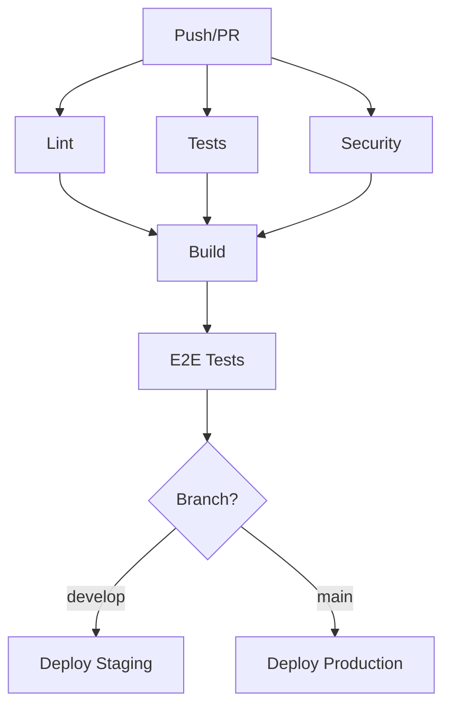

import DifficultyBadge from '@site/src/components/DifficultyBadge';

# CI/CD Pipeline with GitHub Actions

<DifficultyBadge level="intermediate" /> **Estimated duration: 45 minutes**

This tutorial shows you how to set up a complete CI/CD pipeline with GitHub Actions to automate tests, build and deployment.

## Objectives

By the end of this tutorial, you will know how to:
- Use `/ops:ops-ci` to create a pipeline
- Configure automated tests
- Set up continuous deployment
- Manage secrets and environments

## Prerequisites

- A GitHub repository
- A Node.js/React project (or other)
- Basic Git knowledge

## Step 1: Create the base pipeline

```bash
/ops:ops-ci "CI/CD pipeline for a Next.js app with tests, lint and Vercel deployment"
```

Claude will create:

**`.github/workflows/ci.yml`**
```yaml
name: CI/CD Pipeline

on:
  push:
    branches: [main, develop]
  pull_request:
    branches: [main]

env:
  NODE_VERSION: '20'

jobs:
  # Job 1: Lint and type checking
  lint:
    name: Lint & Type Check
    runs-on: ubuntu-latest
    steps:
      - name: Checkout
        uses: actions/checkout@v4

      - name: Setup Node.js
        uses: actions/setup-node@v4
        with:
          node-version: ${{ env.NODE_VERSION }}
          cache: 'npm'

      - name: Install dependencies
        run: npm ci

      - name: Run ESLint
        run: npm run lint

      - name: Run TypeScript check
        run: npm run typecheck

  # Job 2: Unit tests
  test:
    name: Unit Tests
    runs-on: ubuntu-latest
    steps:
      - name: Checkout
        uses: actions/checkout@v4

      - name: Setup Node.js
        uses: actions/setup-node@v4
        with:
          node-version: ${{ env.NODE_VERSION }}
          cache: 'npm'

      - name: Install dependencies
        run: npm ci

      - name: Run tests with coverage
        run: npm run test:coverage

      - name: Upload coverage report
        uses: codecov/codecov-action@v4
        with:
          token: ${{ secrets.CODECOV_TOKEN }}
          files: ./coverage/lcov.info

  # Job 3: Build
  build:
    name: Build
    runs-on: ubuntu-latest
    needs: [lint, test]
    steps:
      - name: Checkout
        uses: actions/checkout@v4

      - name: Setup Node.js
        uses: actions/setup-node@v4
        with:
          node-version: ${{ env.NODE_VERSION }}
          cache: 'npm'

      - name: Install dependencies
        run: npm ci

      - name: Build
        run: npm run build

      - name: Upload build artifacts
        uses: actions/upload-artifact@v4
        with:
          name: build
          path: .next/
          retention-days: 7

  # Job 4: Deployment (only on main)
  deploy:
    name: Deploy to Vercel
    runs-on: ubuntu-latest
    needs: build
    if: github.ref == 'refs/heads/main' && github.event_name == 'push'
    environment:
      name: production
      url: ${{ steps.deploy.outputs.url }}
    steps:
      - name: Checkout
        uses: actions/checkout@v4

      - name: Deploy to Vercel
        id: deploy
        uses: amondnet/vercel-action@v25
        with:
          vercel-token: ${{ secrets.VERCEL_TOKEN }}
          vercel-org-id: ${{ secrets.VERCEL_ORG_ID }}
          vercel-project-id: ${{ secrets.VERCEL_PROJECT_ID }}
          vercel-args: '--prod'
```

## Step 2: Add E2E tests

Let's add Playwright tests to the pipeline:

```bash
/qa:qa-e2e "Configure Playwright for E2E tests in the CI pipeline"
```

**Addition to the workflow:**

```yaml
  # Job 5: E2E tests
  e2e:
    name: E2E Tests
    runs-on: ubuntu-latest
    needs: build
    steps:
      - name: Checkout
        uses: actions/checkout@v4

      - name: Setup Node.js
        uses: actions/setup-node@v4
        with:
          node-version: ${{ env.NODE_VERSION }}
          cache: 'npm'

      - name: Install dependencies
        run: npm ci

      - name: Install Playwright browsers
        run: npx playwright install --with-deps

      - name: Download build artifacts
        uses: actions/download-artifact@v4
        with:
          name: build
          path: .next/

      - name: Run E2E tests
        run: npm run test:e2e

      - name: Upload test results
        if: failure()
        uses: actions/upload-artifact@v4
        with:
          name: playwright-report
          path: playwright-report/
          retention-days: 7
```

## Step 3: Add the security audit

```yaml
  # Job 6: Security audit
  security:
    name: Security Audit
    runs-on: ubuntu-latest
    steps:
      - name: Checkout
        uses: actions/checkout@v4

      - name: Setup Node.js
        uses: actions/setup-node@v4
        with:
          node-version: ${{ env.NODE_VERSION }}
          cache: 'npm'

      - name: Run npm audit
        run: npm audit --audit-level=high

      - name: Run Snyk security scan
        uses: snyk/actions/node@master
        continue-on-error: true
        env:
          SNYK_TOKEN: ${{ secrets.SNYK_TOKEN }}
```

## Step 4: Configure secrets

In GitHub, go to **Settings > Secrets and variables > Actions**:

| Secret | Description |
|--------|-------------|
| `VERCEL_TOKEN` | Vercel token (Settings > Tokens) |
| `VERCEL_ORG_ID` | Your Vercel organization ID |
| `VERCEL_PROJECT_ID` | Vercel project ID |
| `CODECOV_TOKEN` | Codecov token for coverage |
| `SNYK_TOKEN` | Snyk token for security audit |

## Step 5: Configure environments

Create environments for deployments:

1. Go to **Settings > Environments**
2. Create `production` and `staging`
3. Add protection rules:
   - Require reviewers for production
   - Restrict to specific branches

```yaml
  # Staging deployment
  deploy-staging:
    name: Deploy to Staging
    runs-on: ubuntu-latest
    needs: build
    if: github.ref == 'refs/heads/develop'
    environment:
      name: staging
      url: ${{ steps.deploy.outputs.url }}
    steps:
      - name: Deploy to Vercel (Preview)
        uses: amondnet/vercel-action@v25
        with:
          vercel-token: ${{ secrets.VERCEL_TOKEN }}
          vercel-org-id: ${{ secrets.VERCEL_ORG_ID }}
          vercel-project-id: ${{ secrets.VERCEL_PROJECT_ID }}
```

## Step 6: Add the badges

Add the status badges to your README:

```markdown
# My Project


[](https://codecov.io/gh/username/repo)
[](https://my-app.vercel.app)
```

## Step 7: Final complete pipeline

Here is the complete workflow:

```yaml
name: CI/CD Pipeline

on:
  push:
    branches: [main, develop]
  pull_request:
    branches: [main]

concurrency:
  group: ${{ github.workflow }}-${{ github.ref }}
  cancel-in-progress: true

env:
  NODE_VERSION: '20'

jobs:
  lint:
    name: Lint & Type Check
    runs-on: ubuntu-latest
    steps:
      - uses: actions/checkout@v4
      - uses: actions/setup-node@v4
        with:
          node-version: ${{ env.NODE_VERSION }}
          cache: 'npm'
      - run: npm ci
      - run: npm run lint
      - run: npm run typecheck

  test:
    name: Unit Tests
    runs-on: ubuntu-latest
    steps:
      - uses: actions/checkout@v4
      - uses: actions/setup-node@v4
        with:
          node-version: ${{ env.NODE_VERSION }}
          cache: 'npm'
      - run: npm ci
      - run: npm run test:coverage
      - uses: codecov/codecov-action@v4
        with:
          token: ${{ secrets.CODECOV_TOKEN }}

  security:
    name: Security Audit
    runs-on: ubuntu-latest
    steps:
      - uses: actions/checkout@v4
      - uses: actions/setup-node@v4
        with:
          node-version: ${{ env.NODE_VERSION }}
          cache: 'npm'
      - run: npm audit --audit-level=high

  build:
    name: Build
    runs-on: ubuntu-latest
    needs: [lint, test, security]
    steps:
      - uses: actions/checkout@v4
      - uses: actions/setup-node@v4
        with:
          node-version: ${{ env.NODE_VERSION }}
          cache: 'npm'
      - run: npm ci
      - run: npm run build
      - uses: actions/upload-artifact@v4
        with:
          name: build
          path: .next/

  e2e:
    name: E2E Tests
    runs-on: ubuntu-latest
    needs: build
    steps:
      - uses: actions/checkout@v4
      - uses: actions/setup-node@v4
        with:
          node-version: ${{ env.NODE_VERSION }}
          cache: 'npm'
      - run: npm ci
      - run: npx playwright install --with-deps
      - uses: actions/download-artifact@v4
        with:
          name: build
          path: .next/
      - run: npm run test:e2e
      - uses: actions/upload-artifact@v4
        if: failure()
        with:
          name: playwright-report
          path: playwright-report/

  deploy-staging:
    name: Deploy Staging
    runs-on: ubuntu-latest
    needs: [build, e2e]
    if: github.ref == 'refs/heads/develop'
    environment:
      name: staging
    steps:
      - uses: actions/checkout@v4
      - uses: amondnet/vercel-action@v25
        with:
          vercel-token: ${{ secrets.VERCEL_TOKEN }}
          vercel-org-id: ${{ secrets.VERCEL_ORG_ID }}
          vercel-project-id: ${{ secrets.VERCEL_PROJECT_ID }}

  deploy-production:
    name: Deploy Production
    runs-on: ubuntu-latest
    needs: [build, e2e]
    if: github.ref == 'refs/heads/main' && github.event_name == 'push'
    environment:
      name: production
    steps:
      - uses: actions/checkout@v4
      - uses: amondnet/vercel-action@v25
        with:
          vercel-token: ${{ secrets.VERCEL_TOKEN }}
          vercel-org-id: ${{ secrets.VERCEL_ORG_ID }}
          vercel-project-id: ${{ secrets.VERCEL_PROJECT_ID }}
          vercel-args: '--prod'
```

## Step 8: Commit

```bash
/work:work-commit
```

**Suggested message:**

```
ci: add comprehensive CI/CD pipeline

- Add lint and type checking job
- Add unit tests with coverage reporting
- Add security audit with npm audit
- Add E2E tests with Playwright
- Add staging deployment for develop branch
- Add production deployment for main branch
- Configure concurrency and caching
```

## Pipeline visualization



## Next steps

- [Tutorial 07: Legacy Refactoring](/docs/tutorials/refactoring-legacy)
- [Web Guide](/docs/concepts/stack-recipes)
- [Command /ops:ops-monitoring](/docs/commands/ops/ops-monitoring)

---

:::tip Optimization
Use `concurrency` to cancel running jobs when a new commit arrives on the same branch.
:::
