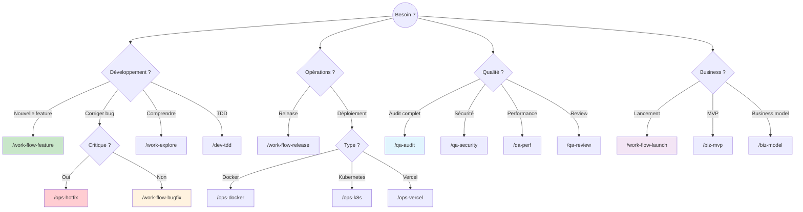

# Choisir le bon workflow

Guide pour selectionner le workflow adapte a votre situation.

## Arbre de decision



## Guide rapide

| Situation | Workflow | Commande |
|-----------|----------|----------|
| Ajouter une fonctionnalite | Feature | `/work-flow-feature` |
| Corriger un bug | Bugfix | `/work-flow-bugfix` |
| Bug critique en prod | Hotfix | `/ops-gitflow-hotfix` |
| Preparer une version | Release | `/work-flow-release` |
| Lancer un produit | Launch | `/work-flow-launch` |
| Comprendre le code | Explore | `/work-explore` |
| Planifier un changement | Plan | `/work-plan` |
| Developper avec tests | TDD | `/dev-tdd` |
| Audit qualite | Audit | `/qa-audit` |
| Review de code | Review | `/qa-review` |

## Par type de projet

### Projet Web (React/Node)

```bash
# Nouvelle feature
/work-explore → /work-plan → /dev-tdd → /work-pr

# Commandes recommandees
/dev-component    # Creer des composants
/dev-hook        # Creer des hooks
/dev-react-perf  # Optimiser les performances
```

### Projet Mobile (Flutter)

```bash
# Nouvelle feature
/work-explore → /work-plan → /dev-flutter → /work-pr

# Commandes recommandees
/dev-flutter     # Widgets et screens
/dev-supabase    # Backend Supabase
/qa-mobile       # Audit mobile
```

### API Backend

```bash
# Nouvelle feature
/work-explore → /work-plan → /dev-api → /work-pr

# Commandes recommandees
/dev-api         # Endpoints REST
/dev-graphql     # API GraphQL
/doc-api-spec    # Documentation OpenAPI
```

### Startup / SaaS

```bash
# Lancement
/biz-model → /biz-mvp → /work-flow-launch

# Commandes recommandees
/biz-*           # Business
/growth-*        # Croissance
/legal-*         # Legal
```

## FAQ

### Quelle est la difference entre /work-flow-feature et le workflow principal ?

`/work-flow-feature` est un **raccourci** qui enchaine automatiquement toutes les etapes du workflow principal (explore, plan, code, commit, PR).

### Quand utiliser /ops-hotfix vs /work-flow-bugfix ?

- **hotfix** : Bug critique en production, besoin immediat
- **bugfix** : Bug normal, peut attendre la prochaine release

### Comment savoir si j'ai besoin d'un audit ?

Utilisez `/qa-audit` :
- Avant une release majeure
- Avant un audit externe
- Apres des changements importants
- Regulierement (mensuel)

### Puis-je combiner plusieurs workflows ?

Oui ! Par exemple :
```bash
# Feature avec audit de securite
/work-flow-feature "Auth" → /qa-security → /work-pr
```

---

## Voir aussi

- [Tous les workflows](/docs/workflow)
- [Commands](/docs/commands)
- [Assistant](/docs/commands/assistant)
