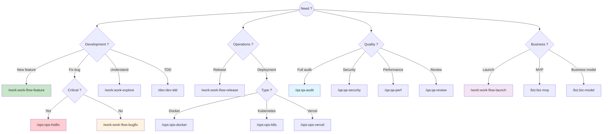

# Choosing the right workflow

Guide to select the workflow suited to your situation.

## Decision tree



## Quick guide

| Situation | Workflow | Command |
|-----------|----------|----------|
| Add a feature | Feature | `/work:work-flow-feature` |
| Fix a bug | Bugfix | `/work:work-flow-bugfix` |
| Critical bug in prod | Hotfix | `/ops:ops-gitflow-hotfix` |
| Prepare a version | Release | `/work:work-flow-release` |
| Launch a product | Launch | `/work:work-flow-launch` |
| Understand the code | Explore | `/work:work-explore` |
| Plan a change | Plan | `/work:work-plan` |
| Develop with tests | TDD | `/dev:dev-tdd` |
| Quality audit | Audit | `/qa:qa-audit` |
| Code review | Review | `/qa:qa-review` |

## By project type

### Web project (React/Node)

```bash
# New feature
/work:work-explore → /work:work-plan → /dev:dev-tdd → /work:work-pr

# Recommended commands
/dev:dev-component    # Create components
/dev:dev-hook        # Create hooks
/dev:dev-react-perf  # Optimize performance
```

### Mobile project (Flutter)

```bash
# New feature
/work:work-explore → /work:work-plan → /dev:dev-flutter → /work:work-pr

# Recommended commands
/dev:dev-flutter     # Widgets and screens
/dev:dev-supabase    # Supabase backend
/qa:qa-mobile       # Mobile audit
```

### Backend API

```bash
# New feature
/work:work-explore → /work:work-plan → /dev:dev-api → /work:work-pr

# Recommended commands
/dev:dev-api         # REST endpoints
/dev:dev-graphql     # GraphQL API
/doc:doc-api-spec    # OpenAPI documentation
```

### Startup / SaaS

```bash
# Launch
/biz:biz-model → /biz:biz-mvp → /work:work-flow-launch

# Recommended commands
/biz:biz-*           # Business
/growth:growth-*        # Growth
/legal:legal-*         # Legal
```

## FAQ

### What's the difference between /work:work-flow-feature and the main workflow?

`/work:work-flow-feature` is a **shortcut** that automatically chains all the steps of the main workflow (explore, plan, code, commit, PR).

### When to use /ops:ops-hotfix vs /work:work-flow-bugfix?

- **hotfix**: Critical bug in production, immediate need
- **bugfix**: Normal bug, can wait for the next release

### How do I know if I need an audit?

Use `/qa:qa-audit`:
- Before a major release
- Before an external audit
- After significant changes
- Regularly (monthly)

### Can I combine multiple workflows?

Yes! For example:
```bash
# Feature with security audit
/work:work-flow-feature "Auth" → /qa:qa-security → /work:work-pr
```

---

## See also

- [All workflows](/docs/workflow)
- [Commands](/docs/commands)
- [Assistant](/docs/commands/other/assistant)
