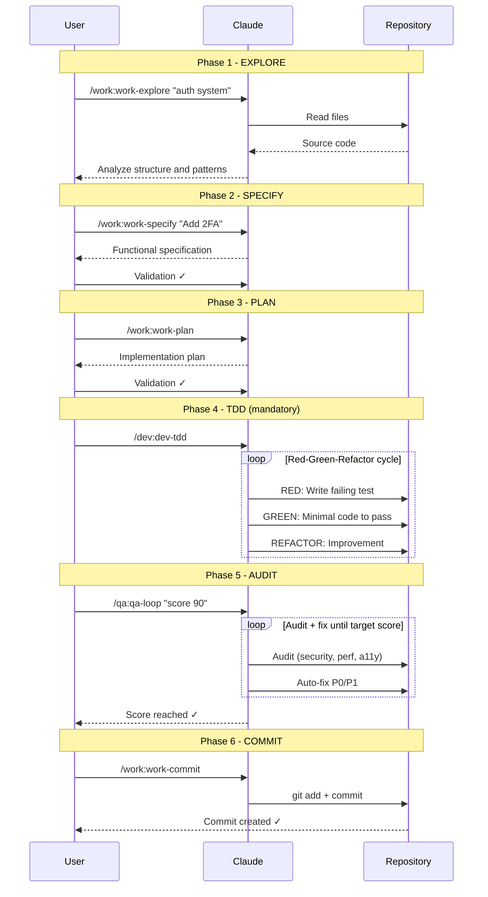

import WorkflowDiagram, { MAIN_WORKFLOW } from '@site/src/components/WorkflowDiagram';

# Main workflow: Explore → Specify → Plan → TDD → Audit → Commit

The fundamental workflow that guarantees quality code with mandatory TDD.

<WorkflowDiagram steps={MAIN_WORKFLOW} />

## Sequence diagram



## Why this workflow?

### Without a structured workflow

```
❌ Coding without understanding → Bugs and regressions
❌ Implementing without a spec → Misaligned scope
❌ Implementing without a plan → Constant refactoring
❌ Coding before tests → Untested code
❌ Skipping the audit → Silent regressions in security/perf/a11y
❌ Giant commits → Unreadable history
```

### With the workflow

```
✅ Explore first → Understand the context
✅ Specify upfront → Clear acceptance criteria
✅ Plan ahead → Solid architecture
✅ Mandatory TDD → Tested and reliable code
✅ Audit + fix loop → Quality target reached before commit
✅ Atomic commits → Clear history
```

## Step 1: Explore

**Command**: `/work:work-explore`

**Goal**: Understand the existing code before modifying.

```bash
/work:work-explore

# Or with a specific focus
/work:work-explore "the authentication system"
```

**Claude will analyze**:
- Project structure
- Patterns and conventions
- Dependencies
- Points of attention

**Expected output**:
```markdown
## Project analysis

### Structure
- /src/auth/ - Authentication module
- /src/api/ - REST endpoints

### Identified patterns
- Repository pattern
- Dependency injection

### Points of attention
- Missing tests on AuthService
```

## Step 2: Specify

**Command**: `/work:work-specify`

**Goal**: Define user stories and acceptance criteria before designing.

```bash
/work:work-specify "Add 2FA authentication"
```

**Claude will produce**:
- Prioritized user stories (P1 = MVP, P2, P3)
- Acceptance criteria (Given/When/Then)
- Functional requirements and edge cases
- Out-of-scope explicitly listed

**Expected output**:
```markdown
## User stories

### US-1 (P1) — Enable 2FA on the account
As a user, I want to enable 2FA so that my account is protected.

Given I am authenticated, when I scan the TOTP QR code and confirm
the 6-digit code, then 2FA is enabled and a recovery code is shown.

### US-2 (P2) — Sign in with 2FA
As a user with 2FA, I want to sign in with my TOTP code...
```

:::caution Important
Wait for spec validation before planning!
:::

## Step 3: Plan

**Command**: `/work:work-plan`

**Goal**: Plan changes before implementing.

```bash
/work:work-plan
```

**Claude will propose**:
- Recommended architecture
- Files to create/modify
- Identified risks
- Tests to write

**Expected output**:
```markdown
## Implementation plan

### Files to create
- src/auth/two-factor.service.ts
- src/auth/two-factor.controller.ts

### Files to modify
- src/auth/auth.module.ts

### Risks
- Impact on existing login

### Required tests
- test/two-factor.spec.ts
```

:::caution Important
Wait for plan validation before coding!
:::

## Step 4: TDD (Mandatory)

**Command**: `/dev:dev-tdd`

**Goal**: Implement following the Red-Green-Refactor cycle.

```bash
/dev:dev-tdd "Implement the 2FA service"
```

**Mandatory TDD cycle**:
1. **RED**: Write a failing test
2. **GREEN**: Write the minimal code to pass the test
3. **REFACTOR**: Improve the code without breaking the tests

**Best practices**:
- Always write tests BEFORE the code
- Follow the plan strictly
- One commit per logical change
- Minimum 80% coverage on new code

## Step 5: Audit

**Command**: `/qa:qa-loop`

**Goal**: Run an adaptive audit + fix loop until the target quality score is reached.

```bash
/qa:qa-loop "score 90"
```

**Coverage**:
- Security (OWASP Top 10)
- Performance (Core Web Vitals)
- Accessibility (WCAG 2.1)
- Code quality and conventions

**Behavior**: P0/P1 issues are fixed automatically and the audit runs in a loop until the target score is reached. TDD validates behavior, the audit validates overall quality.

:::caution Important
Do not commit without having reached the target score (90 by default).
:::

## Step 6: Commit

**Command**: `/work:work-commit` or `/work:work-pr`

**Goal**: Create clean and descriptive commits.

```bash
# Simple commit
/work:work-commit

# Or full Pull Request
/work:work-pr
```

**Commit format**:
```
type(scope): description

[optional body]

[optional footer]
```

**Example**:
```
feat(auth): add two-factor authentication

- Add TwoFactorService with TOTP support
- Add verification endpoint
- Add tests for 2FA flow

Closes #123
```

## Full example

```bash
# 1. Explore the existing auth code
> /work:work-explore "authentication system"

# Claude analyzes and explains the structure

# 2. Specify the 2FA feature
> /work:work-specify "Add 2FA authentication"

# Claude produces user stories and acceptance criteria
# You validate or request changes

# 3. Plan the 2FA addition
> /work:work-plan

# Claude proposes a detailed plan
# You validate or request changes

# 4. Implement in TDD (mandatory)
> /dev:dev-tdd "Implement the 2FA service per the plan"

# Claude follows the Red-Green-Refactor cycle:
# - RED: Writes failing tests
# - GREEN: Writes minimal code to pass
# - REFACTOR: Improves the code

# 5. Audit + fix loop until score 90
> /qa:qa-loop "score 90"

# Claude audits security, perf, a11y and auto-fixes P0/P1
# until the target score is reached

# 6. Create the PR
> /work:work-pr

# Claude creates a complete PR with description
```

## Shortcut: Full workflow

For a new feature, use directly:

```bash
/work:work-flow-feature "Add 2FA authentication"
```

This command automatically chains the full workflow.

---

## See also

- [New Feature](/docs/workflow/feature) - Full feature workflow
- [TDD](/docs/workflow/tdd) - Test-driven development
- [WORK Commands](/docs/commands/work) - All workflow commands
