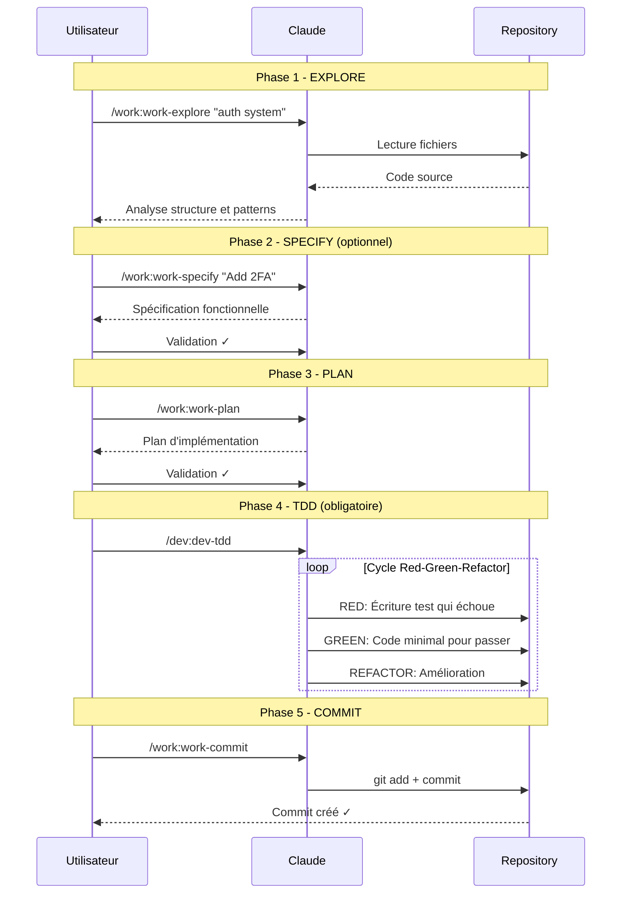

import WorkflowDiagram, { MAIN_WORKFLOW } from '@site/src/components/WorkflowDiagram';

# Workflow principal : Explore → Specify → Plan → TDD → Audit → Commit

Le workflow fondamental qui garantit un code de qualite avec TDD obligatoire.

<WorkflowDiagram steps={MAIN_WORKFLOW} />

## Diagramme de séquence



## Pourquoi ce workflow ?

### Sans workflow structure

```
❌ Coder sans comprendre → Bugs et regressions
❌ Implementer sans plan → Refactoring constant
❌ Coder avant les tests → Code non teste
❌ Commits geants → Historique illisible
```

### Avec le workflow

```
✅ Explorer d'abord → Comprendre le contexte
✅ Planifier avant → Architecture solide
✅ TDD obligatoire → Code teste et fiable
✅ Commits atomiques → Historique clair
```

## Etape 1 : Explore

**Commande** : `/work:work-explore`

**Objectif** : Comprendre le code existant avant de modifier.

```bash
/work:work-explore

# Ou avec un focus specifique
/work:work-explore "le systeme d'authentification"
```

**Claude analysera** :
- Structure du projet
- Patterns et conventions
- Dependances
- Points d'attention

**Output attendu** :
```markdown
## Analyse du projet

### Structure
- /src/auth/ - Module d'authentification
- /src/api/ - Endpoints REST

### Patterns identifies
- Repository pattern
- Dependency injection

### Points d'attention
- Tests manquants sur AuthService
```

## Etape 2 : Plan

**Commande** : `/work:work-plan`

**Objectif** : Planifier les modifications avant d'implementer.

```bash
/work:work-plan "Ajouter l'authentification 2FA"
```

**Claude proposera** :
- Architecture recommandee
- Fichiers a creer/modifier
- Risques identifies
- Tests a ecrire

**Output attendu** :
```markdown
## Plan d'implementation

### Fichiers a creer
- src/auth/two-factor.service.ts
- src/auth/two-factor.controller.ts

### Fichiers a modifier
- src/auth/auth.module.ts

### Risques
- Impact sur le login existant

### Tests requis
- test/two-factor.spec.ts
```

:::caution Important
Attendez la validation du plan avant de coder !
:::

## Etape 3 : TDD (Obligatoire)

**Commande** : `/dev:dev-tdd`

**Objectif** : Implementer en suivant le cycle Red-Green-Refactor.

```bash
/dev:dev-tdd "Implementer le service 2FA"
```

**Cycle TDD obligatoire** :
1. **RED** : Ecrire un test qui echoue
2. **GREEN** : Ecrire le code minimal pour passer le test
3. **REFACTOR** : Ameliorer le code sans casser les tests

**Bonnes pratiques** :
- Toujours ecrire les tests AVANT le code
- Suivre le plan strictement
- Un commit par changement logique
- Couverture minimum 80% sur nouveau code

## Etape 4 : Commit

**Commande** : `/work:work-commit` ou `/work:work-pr`

**Objectif** : Creer des commits propres et descriptifs.

```bash
# Commit simple
/work:work-commit

# Ou Pull Request complete
/work:work-pr
```

**Format de commit** :
```
type(scope): description

[corps optionnel]

[footer optionnel]
```

**Exemple** :
```
feat(auth): add two-factor authentication

- Add TwoFactorService with TOTP support
- Add verification endpoint
- Add tests for 2FA flow

Closes #123
```

## Exemple complet

```bash
# 1. Explorer le code d'auth existant
> /work:work-explore "systeme d'authentification"

# Claude analyse et explique la structure

# 2. Planifier l'ajout de 2FA
> /work:work-plan "Ajouter l'authentification 2FA"

# Claude propose un plan detaille
# Vous validez ou demandez des modifications

# 3. Implementer en TDD (obligatoire)
> /dev:dev-tdd "Implementer le service 2FA selon le plan"

# Claude suit le cycle Red-Green-Refactor :
# - RED: Ecrit les tests qui echouent
# - GREEN: Ecrit le code minimal pour passer
# - REFACTOR: Ameliore le code

# 4. Creer la PR
> /work:work-pr

# Claude cree une PR complete avec description
```

## Raccourci : Workflow complet

Pour une nouvelle feature, utilisez directement :

```bash
/work:work-flow-feature "Ajouter l'authentification 2FA"
```

Cette commande enchaine automatiquement le workflow complet.

---

## Voir aussi

- [Nouvelle Feature](/docs/workflow/feature) - Workflow feature complet
- [TDD](/docs/workflow/tdd) - Developpement guide par les tests
- [Commands WORK](/docs/commands/work) - Toutes les commandes workflow
